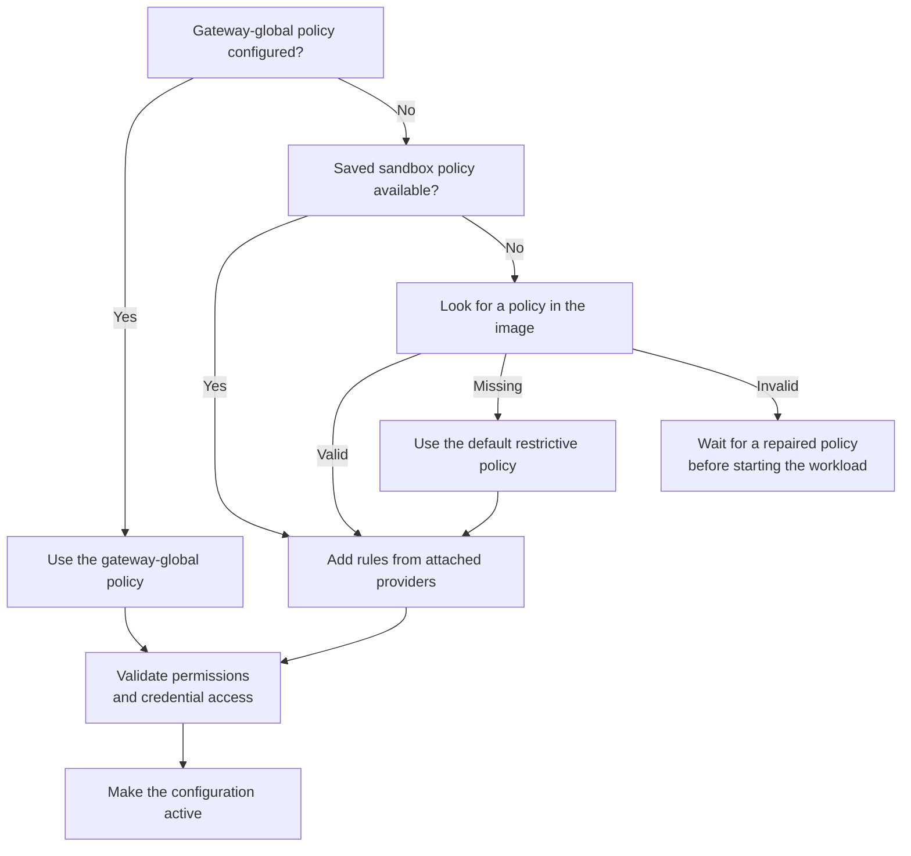
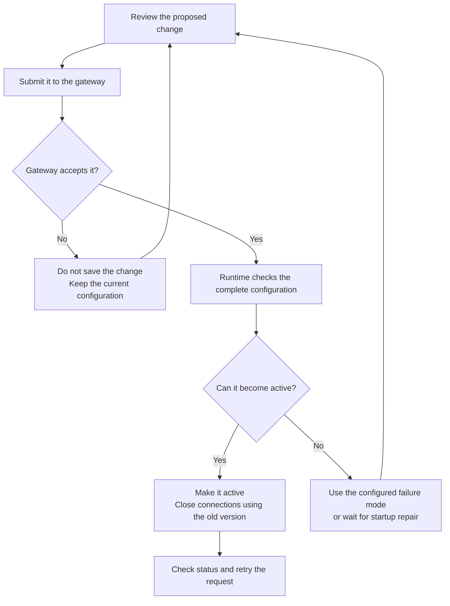

Use a sandbox policy to control which files a program can access and which
services it can contact. This guide shows how to let curl read the GitHub API
while keeping POST requests blocked.

## Prerequisites

Install `jq`, then complete [Prepare the Tutorial
Sandbox](/get-started/tutorials/first-network-policy#prepare-the-tutorial-sandbox).
Keep the resulting Docker-backed sandbox named `demo` running. Use an isolated
gateway without a gateway-global policy for this exercise.

The base policy is the policy configured for this sandbox. The effective policy
includes rules contributed by attached providers, unless a gateway-global
policy replaces normal sandbox and provider selection. Inspect the effective
policy to understand the network permissions selected for the sandbox. A
selected policy still must activate in the runtime before the workload uses it.

## Policy Structure

A network rule controls which executable can connect to a destination. An
inspected endpoint can also limit application requests. This excerpt already
includes the `network_policies` wrapper; place it beside `version: 1` and the
other top-level policy sections:

```yaml
network_policies:
  github_readonly:
    name: github-readonly
    endpoints:
      - host: api.github.com
        port: 443
        protocol: rest
        enforcement: enforce
        access: read-only
    binaries:
      - path: /usr/bin/curl
```

The rule permits `/usr/bin/curl` to connect to `api.github.com:443` and permits
the REST methods in the `read-only` preset. `enforcement: enforce` is necessary
for blocking. The default enforcement mode is `audit`, which logs an applicable
request-rule violation but forwards the request.

Filesystem, Landlock, and process settings are startup-time controls. Network
rules and middleware attachments can change after creation, subject to the
lifecycle limits in [Understand Reloads](#understand-reloads). Refer to the
[Policy Schema Reference](/reference/policy-schema) for every accepted field.

## Choose How to Change a Policy

Choose the narrowest operation that represents your intent.

| Operation | Use it when | Important behavior |
|---|---|---|
| `sandbox create --policy` | You know the complete policy before creation. | The file supplies the initial authored policy and can set startup-time controls. |
| `policy update` | You need to add or remove network permissions. | It changes only `network_policies` and preserves every other section. |
| `policy set` | You need to replace the complete policy, including middleware or startup settings. | Export the base first so you do not drop required static fields or submit provider-owned rules. |

## Allow an API Request

First confirm that the sandbox has no effective network grants:

```shell
openshell policy get demo --full --output json \
  | jq '.policy.network_policies // {}'
```

An empty object establishes the expected starting point. `--no-auto-providers`
does not suppress an active global policy or an embedded image policy, so inspect
the effective result instead of assuming default-deny.

Confirm that the initial GET is denied by OpenShell:

```shell
openshell sandbox exec -n demo --no-login-shell -- \
  /usr/bin/curl --silent --show-error --fail --max-time 10 \
  https://api.github.com/zen
openshell logs demo --since 5m --source sandbox
```

Curl can surface the first denial as `Could not resolve host` because policy DNS
refuses names with no eligible rule. Look for a matching `NET:REFUSE` event for
`api.github.com:53` with reason `policy_dns_ineligible`. That event distinguishes
the policy denial from an unrelated DNS failure, missing tool, or TLS trust
failure.

Add the enforced REST rule without replacing the rest of the policy:

```shell
openshell policy update demo \
  --rule-name github_readonly \
  --binary /usr/bin/curl \
  --add-endpoint api.github.com:443:read-only:rest:enforce \
  --wait
```

Verify both sides of the boundary:

```shell
openshell sandbox exec -n demo --no-login-shell -- \
  /usr/bin/curl --silent --show-error --fail --max-time 15 \
  https://api.github.com/zen
openshell sandbox exec -n demo --no-login-shell -- \
  /usr/bin/curl --silent --show-error --max-time 15 \
  --request POST https://api.github.com/zen
```

The GET succeeds. The POST returns an OpenShell HTTP 403 response containing
`policy_denied`. An upstream error is not evidence of enforcement. The preset
controls HTTP methods; the API determines what those methods do.

Rules are not an ordered firewall list. Compatible rules that match the same
request can contribute permissions, and an applicable request deny takes
precedence over an allow. OpenShell selects request-processing metadata from the
most-specific compatible endpoint separately from deciding whether to allow the
request.

## Incremental Policy Updates

Use `policy update` to add or remove network permissions. When a change affects
an existing rule, identify the existing binaries, ports, and endpoint path that
the change applies to. This prevents the update from authorizing undeclared
binary-to-endpoint pairs.

For example, preview a deny that blocks `GET /zen` while the rule's other
read-only requests remain allowed:

```shell
openshell policy update demo \
  --add-deny 'api.github.com:443:GET:/zen' \
  --rule-name github_readonly \
  --binary /usr/bin/curl \
  --dry-run
```

The preview connects to the gateway, fetches the current policy, and renders the
merge locally. It does not save a revision, and it does not prove that every
gateway, provider, or runtime check will accept a later submission. Refer to the
[Incremental Policy Update Reference](/reference/policy-updates) for the full
grammar, scope rules, and status behavior.

## Inspect and Replace a Policy

Inspect the base and effective views before making a broad change:

```shell
openshell policy get demo --base
openshell policy get demo --full
```

For an editable file, use JSON output and `jq`. JSON is accepted by the same
authored-policy parser as YAML:

```shell
set -o pipefail
openshell policy get demo --base --output json \
  | jq -e '.policy' > demo-base.json
```

This removes display metadata and reserved provider-owned `_provider_*` entries.
Edit `demo-base.json`, then replace the policy:

```shell
openshell policy set demo --policy demo-base.json --wait
openshell policy list demo
```

`--wait` can finish successfully for a loaded, unchanged, or superseded result.
Inspect the active revision and retry the request. Without `--wait`, command
success means only that submission succeeded.

Export the current effective policy for review or an optional containment check:

```shell
openshell sandbox get demo --policy-only > demo-effective.yaml
```

Do not submit that effective export as the sandbox base. It can contain
provider-owned entries.

To restore an earlier compatible base revision, export it without metadata and
submit it as a new revision:

```shell
set -o pipefail
openshell policy get demo --rev 2 --base --output json \
  | jq -e '.policy' > previous-base.json
openshell policy set demo --policy previous-base.json --wait
```

This restores the sandbox-authored policy only. It does not roll back provider
profiles, attachments, credentials, or gateway-global configuration that changed
independently.

## Understand Policy Sources

The gateway composes a sandbox's effective configuration from one policy source
and, when allowed, attached provider policy layers.



This diagram shows source precedence. At creation, an explicit `--policy` file
takes precedence over `OPENSHELL_SANDBOX_POLICY`. OpenShell looks inside the
image only when the sandbox has no saved policy. A gateway-global policy replaces
normal sandbox policy selection and prevents provider rules from being added.

## Global Policy Override

A platform administrator can set a gateway-global policy. It replaces each
sandbox policy; it is not a ceiling intersected with existing grants. While it
is active, sandbox policy updates are blocked and provider-added network grants
are suppressed. Credential authorization remains a separate check, so a network
grant alone does not make a provider credential usable at a destination.

Deleting the global override restores normal sandbox selection and provider
composition. The gateway rejects restoration when the resulting effective
configuration is invalid. Inspect effective policy before, during, and after an
operator changes the override.

Inspect the current override, apply a reviewed complete policy, and remove the
override with the gateway-global commands:

```shell
openshell policy get --global --full
openshell policy set --global --policy ./global-policy.yaml
openshell policy list --global
openshell policy delete --global
```

The set and delete commands ask for confirmation unless you pass `--yes`. Keep
the prompt during interactive work because each operation changes the network
model for every sandbox on the gateway.

## Understand Reloads

OpenShell validates a proposed policy before activating it. Network rules and
middleware can change while the workload runs. Filesystem and process settings
have different limits.

| Change | Running workload behavior | Required action |
|---|---|---|
| Network request rules | The running workload receives the new rules. Connections using the previous active configuration close. | Use `update` or `set`, inspect status, and retry. |
| Middleware attachments | The running workload receives the new attachments, but incremental network updates do not edit them. | Preserve the base and use `set`. |
| First native TCP endpoint | The standard runtime can add it while the workload runs because policy DNS and transparent capture are already available. | Use `update` or `set`, inspect status, and retry. |
| Added filesystem paths | The saved policy can change, but the running workload keeps its existing filesystem permissions. | Recreate the sandbox to apply the new startup configuration. |
| Removed baseline paths or changed workdir, Landlock, or process identity | OpenShell rejects the change after the workload starts. | Recreate the sandbox with the intended startup configuration. |
| Repair before first activation | If the workload has never started, you can replace rejected startup settings. | Repair them before provisioning times out. |

OpenShell calls each version of the active configuration a generation. When a
new generation becomes active, OpenShell closes HTTP keep-alive connections,
tunnels, upgrades, and long-lived streams that still use the previous one. A
parsed WebSocket relay closes with code `1012`. The client must reconnect so its
next request uses the new configuration.



A no-op update may create no new revision. Gateway acceptance is also distinct
from runtime activation. The troubleshooting guide explains `fail_closed`,
`retain_last_valid`, provisioning repair, and CLI wait timeouts.

## Allow Native TCP Connections

Use `protocol: tcp` for clients that need ordinary DNS resolution and a native
TCP socket without application payload inspection. It supports Docker and
Podman. The standard runtime prepares its capture substrate even when the
initial policy has no TCP endpoints, so you can add the first endpoint live. Refer to
[Configure Network Policy Rules](/sandboxes/network-policy-recipes#allow-native-tcp)
for the recipe and shared-hosting limitations.

## Supervisor Middleware

Optional middleware can inspect selected HTTP requests before credential
injection, selected HTTP responses before return, and complete client WebSocket
text messages when the implementation advertises those operations. Host matching
alone does not select every operation. Middleware does not inspect binary or
upstream-to-client WebSocket messages. Refer to
[Supervisor Middleware](/extensibility/supervisor-middleware) for registration,
ordering, mutation, limits, and failure behavior.

## Validation Failures

A local parse error, gateway preflight rejection, initial configuration failure,
runtime rejection, wait timeout, credential denial, and middleware denial have
different effects. Do not widen endpoint access to repair a credential or
middleware problem.

Use [Troubleshoot Sandbox Policies](/sandboxes/troubleshoot-policies) to identify
the stage, whether the previous policy remains active, and the corrective action.
Gateway failure-mode settings are defined in
[Gateway Configuration](/reference/gateway-config).

## Next Steps

- Use [Configure Network Policy Rules](/sandboxes/network-policy-recipes) for
  REST, native TCP, WebSocket, GraphQL, MCP, and JSON-RPC recipes.
- Use the [Policy Schema Reference](/reference/policy-schema) for fields,
  defaults, matching rules, and constraints.
- Use [Policy Advisor](/sandboxes/policy-advisor) to let a sandbox propose a
  narrow network change for review.
- Use the [Standalone Policy Prover](/reference/policy-prover) as an optional
  containment check. Its result covers only the modeled domains and does not
  apply policy or attest runtime state.
