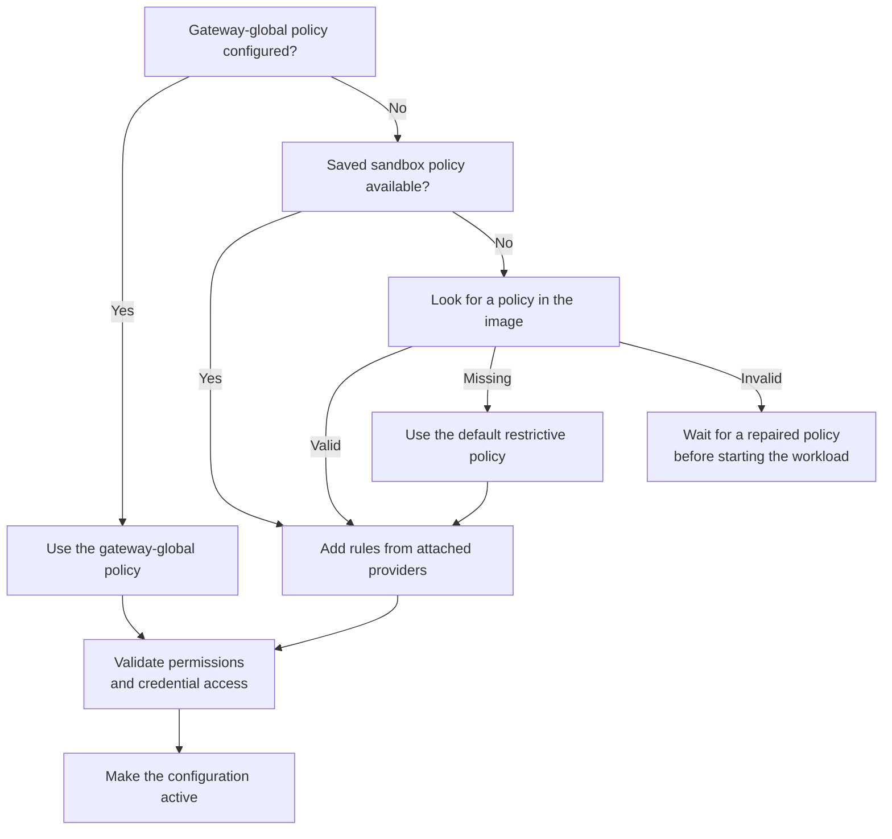
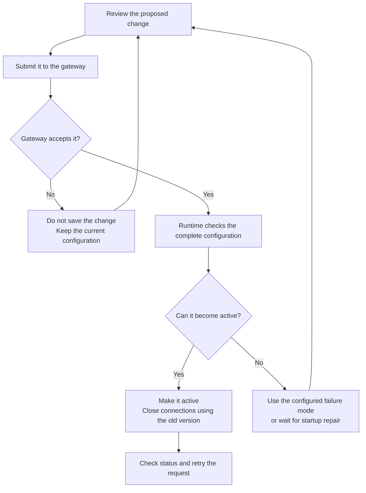

Use sandbox policies to control which files programs can access, which network
destinations they can reach, and which application requests they can make. This
guide explains how to inspect, change, and verify those permissions.

## Policy Structure

Policies are declarative YAML configurations. You specify access rules and
processing settings, and OpenShell enforces them. The following outline shows
the policy sections with their contents omitted:

```yaml
version: 1
filesystem_policy: { ... }   # Paths programs can read or write.
landlock: { ... }            # Linux filesystem enforcement settings.
process: { ... }             # User and group for sandbox processes.
network_policies: { ... }    # Network destinations and permitted requests.
network_middlewares: { ... } # Additional traffic processing.
```

`network_policies` controls which programs can connect to a destination and which
application requests they can make. `network_middlewares` selects additional
processing, such as redaction or filtering, for traffic the network rules allow.
Middleware does not grant network access.

Filesystem enforcement and process identity are set when the workload starts.
Network rules and policy settings for built-in or already registered middleware
can change while it runs, subject to the lifecycle limits given in
[Understand Reloads](#understand-reloads). Registering a new external middleware
service or changing its gateway registration requires a gateway restart.

Refer to the [Policy Schema Reference](/reference/policy-schema) for every
accepted field.

## Choose How to Change a Policy

Choose the narrowest operation that represents your intent. The base policy is
the policy configured for the sandbox. The effective policy includes rules
contributed by attached providers, unless a gateway-global policy replaces
normal sandbox and provider selection.

| Operation | Use it when | Important behavior |
|---|---|---|
| `sandbox create --policy` | You know the complete policy before creation. | The file supplies the initial authored policy and can set startup-time controls. |
| `policy update` | You need to add or remove network permissions. | It changes only `network_policies` and preserves every other section. |
| `policy set` | You need to replace the complete policy, including middleware or startup settings. | Start from the current base so you preserve required startup settings and exclude provider-owned rules. |

## Allow an API Request

To allow an API request, select the program, destination, and permitted request
types. For example, this network rule permits curl to read the GitHub API:

```yaml
network_policies:
  github_readonly:
    name: github-readonly
    endpoints:
      - host: api.github.com
        port: 443
        protocol: rest
        enforcement: enforce
        access: read-only
    binaries:
      - path: /usr/bin/curl
```

The rule permits `/usr/bin/curl` to connect to `api.github.com:443` and use the
REST methods in the `read-only` preset. `enforcement: enforce` blocks requests
outside that set. The default mode is `audit`, which logs a request-rule
violation but forwards the request.

Use `policy update` to add this permission without replacing the rest of the
policy. Replace `my-sandbox` with your sandbox name; the executable path must
match the program inside that sandbox:

```shell
openshell policy update my-sandbox \
  --rule-name github_readonly \
  --binary /usr/bin/curl \
  --add-endpoint api.github.com:443:read-only:rest:enforce \
  --wait
```

Review the effective policy before adding a grant because other rules can also
permit the requests you intend to block. Rules are not an ordered firewall list.
Rules that match the same request can contribute permissions together, and an
applicable deny takes precedence over an allow. See [Understand Overlapping
Rules](/sandboxes/network-policy-recipes#understand-overlapping-rules) for how
OpenShell combines permissions and selects request-processing settings.

After activation, verify both an allowed request and a request that should remain
blocked. Confirm the denial comes from OpenShell rather than the upstream
service. For a complete exercise with setup, commands, and expected responses,
see [Write Your First Sandbox Network
Policy](/get-started/tutorials/first-network-policy).

## Incremental Policy Updates

Use `policy update` to add or remove network permissions. When appending request
allow or deny rules to an existing endpoint, identify its rule, specify the
rule's complete binary list and the endpoint's complete port list, and include
the endpoint path when needed. This prevents a narrow edit from accidentally
giving other programs access to the destination.

For a sandbox with the `github_readonly` rule shown above, this command previews
a deny for `GET /zen` while leaving the rule's other read-only requests allowed:

```shell
openshell policy update my-sandbox \
  --add-deny 'api.github.com:443:GET:/zen' \
  --rule-name github_readonly \
  --binary /usr/bin/curl \
  --dry-run
```

The preview fetches the current policy from the gateway and shows the proposed
result locally. It does not save a revision or run every check needed to activate
the change. Refer to the [Incremental Policy Update
Reference](/reference/policy-updates) for the full
grammar, scope rules, and status behavior.

## Inspect and Replace a Policy

Use the base view as your editable starting point and the effective view to
review permissions from all selected sources. Replace `my-sandbox` with your
sandbox name:

```shell
openshell policy get my-sandbox --base
openshell policy get my-sandbox --full
```

The base view prints status metadata followed by a `---` separator and the policy
in YAML. Copy only the YAML below the separator into `policy.yaml`. Keep the
complete policy, including its filesystem, Landlock, process, and unrelated
network settings, then edit the sections you intend to change. Do not redirect
the entire output into a policy file, because the metadata is not part of the
policy.

Apply the complete file and inspect the revision:

```shell
openshell policy set my-sandbox --policy policy.yaml --wait
openshell policy list my-sandbox
```

`--wait` can finish successfully for a loaded, unchanged, or superseded result.
Inspect the active revision and retry the request. Without `--wait`, command
success means only that submission succeeded.

Export the current effective policy for review or an optional containment check:

```shell
openshell sandbox get my-sandbox --policy-only > effective-policy.yaml
```

Do not submit that effective export as the sandbox base. It can contain
provider-owned entries.

To restore an earlier compatible base revision, follow [Restore an Earlier Base
Revision](/sandboxes/troubleshoot-policies#restore-an-earlier-base-revision).

### Export JSON for Automation

If you use `jq` for scripting, you can extract an editable policy without copying
the YAML manually. This optional workflow requires `jq` on your host. JSON is
accepted by the same policy parser as YAML:

```shell
set -o pipefail
openshell policy get my-sandbox --base --output json \
  | jq -e '.policy' > base-policy.json
```

`--base` excludes provider-owned entries, and `jq` extracts the policy from the
JSON response. Edit `base-policy.json`, then pass it to `policy set`
instead of `policy.yaml`.

## Understand Policy Sources

The gateway composes a sandbox's effective configuration from one policy source
and, when allowed, attached provider policy layers.



This diagram shows source precedence. At creation, an explicit `--policy` file
takes precedence over `OPENSHELL_SANDBOX_POLICY`. OpenShell looks inside the
image only when the sandbox has no saved policy. A gateway-global policy replaces
normal sandbox policy selection and prevents provider rules from being added.

## Global Policy Override

A platform administrator can set a gateway-global policy. It replaces each
sandbox policy; it is not a ceiling intersected with existing grants. While it
is active, sandbox policy updates are blocked and provider-added network grants
are suppressed. Credential authorization remains a separate check, so a network
grant alone does not make a provider credential usable at a destination.

Deleting the global override restores normal sandbox selection and provider
composition. The gateway rejects restoration when the resulting effective
configuration is invalid. Inspect effective policy before, during, and after an
operator changes the override.

Inspect the current override, apply a reviewed complete policy, and remove the
override with the gateway-global commands:

```shell
openshell policy get --global --full
openshell policy set --global --policy ./global-policy.yaml
openshell policy list --global
openshell policy delete --global
```

The set and delete commands ask for confirmation unless you pass `--yes`. Keep
the prompt during interactive work because each operation changes the network
model for every sandbox on the gateway.

## Understand Reloads

OpenShell validates a proposed policy before activating it. Network rules and
the policy's middleware settings can change while the workload runs. Filesystem
and process settings take effect at startup. External middleware registration is
a separate gateway operation.

| Change | Running workload behavior | Required action |
|---|---|---|
| Network request rules | The running workload receives the new rules. Connections using the previous active configuration close. | Use `update` or `set`, inspect status, and retry. |
| Middleware selected or configured in `network_middlewares` | You can add, remove, or reconfigure built-in middleware and external services already registered with the gateway. | Preserve the base and use `set`; `update` does not edit middleware. |
| External middleware registration in gateway TOML | Policy updates cannot register a new service or change its gateway connection settings. | Update the registration and restart the gateway. |
| First native TCP endpoint | The standard runtime can add it while the workload runs because policy DNS and transparent capture are already available. | Use `update` or `set`, inspect status, and retry. |
| Added filesystem paths | The saved policy can change, but the running workload keeps its existing filesystem permissions. | Recreate the sandbox to apply the new startup configuration. |
| Removed baseline paths or changed workdir, Landlock, or process identity | OpenShell rejects the change after the workload starts. | Recreate the sandbox with the intended startup configuration. |
| Repair before first activation | If the workload has never started, you can replace rejected startup settings. | Repair them before provisioning times out. |

OpenShell calls each version of the active configuration a generation. When a
new generation becomes active, OpenShell closes HTTP keep-alive connections,
tunnels, upgrades, and long-lived streams that still use the previous one. A
parsed WebSocket relay closes with code `1012`. The client must reconnect so its
next request uses the new configuration.



A no-op update may create no new revision. Gateway acceptance is also distinct
from runtime activation. The troubleshooting guide explains `fail_closed`,
`retain_last_valid`, provisioning repair, and CLI wait timeouts.

## Allow Native TCP Connections

Use `protocol: tcp` for clients that need ordinary DNS resolution and a native
TCP socket without application payload inspection. It supports Docker and
Podman. The standard runtime prepares DNS and TCP connection handling even when
the initial policy has no TCP endpoints, so you can add the first endpoint
without recreating the sandbox. Refer to
[Configure Network Policy Rules](/sandboxes/network-policy-recipes#allow-native-tcp)
for the recipe and shared-hosting limitations.

## Supervisor Middleware

Use `network_middlewares` to select middleware, choose the destination hosts it
applies to, and configure its behavior. Network rules must allow the traffic
before middleware can process it.

Middleware can inspect HTTP requests before credential injection, HTTP responses
before they reach the sandbox, and complete client WebSocket text messages. Each
implementation declares which operations it supports; matching a destination
host does not enable unsupported operations. Binary and upstream-to-client
WebSocket messages are not inspected.

Built-in middleware is available without registration. External middleware must
be registered in the gateway configuration before a policy can use it. Once it
is registered, a policy change can add it to or remove it from a running sandbox,
or change its policy settings. Adding or changing the gateway registration
requires restarting the gateway. Refer to
[Supervisor Middleware](/extensibility/supervisor-middleware) for registration,
processing order, supported transformations, and failure behavior.

## Validation Failures

A local parse error, gateway preflight rejection, initial configuration failure,
runtime rejection, wait timeout, credential denial, and middleware denial have
different effects. Do not widen endpoint access to repair a credential or
middleware problem.

Use [Troubleshoot Sandbox Policies](/sandboxes/troubleshoot-policies) to identify
the stage, whether the previous policy remains active, and the corrective action.
Gateway failure-mode settings are defined in
[Gateway Configuration](/reference/gateway-config).

## Next Steps

- Use [Configure Network Policy Rules](/sandboxes/network-policy-recipes) for
  REST, native TCP, WebSocket, GraphQL, MCP, and JSON-RPC recipes.
- Use the [Policy Schema Reference](/reference/policy-schema) for fields,
  defaults, matching rules, and constraints.
- Use [Policy Advisor](/sandboxes/policy-advisor) to let a sandbox propose a
  narrow network change for review.
- Use the [Standalone Policy Prover](/reference/policy-prover) as an optional
  containment check. Its result covers only the modeled domains and does not
  apply policy or attest runtime state.
