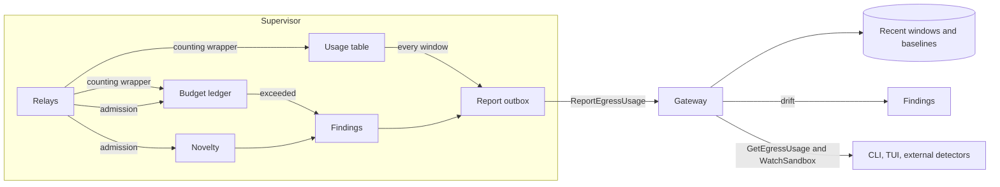

---
authors:
  - "@Hugoch"
state: draft
links:
  - (originating GitHub issue where maintainers assign this RFC number)
---

# RFC NNNN - Egress Usage Monitoring

## Summary

This RFC proposes egress usage monitoring for sandboxes. The supervisor counts how much each sandbox uses every allowed egress endpoint: connections, requests, bytes in each direction, and response classes. It reports these counts to the gateway as periodic usage summaries.

On top of these counts, the RFC adds three signals. **Budgets** are ceilings in a new dynamic policy section that the supervisor enforces. **Novelty** findings report the first use of a host, a binary, or an L7 rule under an allowed policy. **Drift** findings report a change in endpoint usage against a baseline. All signals produce OCSF Detection Findings and structured findings in the usage reports.

## Motivation

Network policy in OpenShell decides *where* a sandbox can connect. After policy allows an endpoint, OpenShell does not control *how much* the agent uses it. An agent with access to `api.github.com` can open one issue or ten thousand. An agent with read access to a model hub can download one model or the complete catalog. An agent that is allowed to call an internal service can retry a failing request in a tight loop for hours. Each of these patterns is legal under the current policy, and each can harm the remote resource, its owner, or the operator's bill.

The current observability covers part of this problem:

- The supervisor emits an OCSF `L7_REQUEST` event for each allowed L7 request (`l7/relay.rs:1379`). An operator who ships the OCSF JSONL export to a SIEM can compute request rates offline. There is no enforcement, and the result depends on each operator's pipeline.
- No event records bytes or duration for workload egress. The relays compute byte counts and discard them: `tokio::io::copy_bidirectional` returns the bytes in each direction at `proxy/relay.rs:309`, `l7/relay.rs:803`, and `l7/relay.rs:1590`. The supervisor emits no close event for a workload egress connection.
- The `ActivityAggregator` counts allowed and denied actions without a destination, by design, for anonymous telemetry. The `DenialAggregator` sees only denied traffic. Endpoint status keeps only the last result per endpoint.
- OpenTelemetry export is traces only. The supervisor exports no metrics.
- `architecture/sandbox-limits.md` lists a known gap: there is no aggregate connection budget and no per-destination fairness policy.

Supervisor middleware (RFC 0009) can observe allowed HTTP requests and WebSocket text messages. It does not solve this problem. It sees only parsed HTTP traffic, so `tls: skip` and raw TCP endpoints are invisible. It receives no process identity (`originating_process` is always unset). It has no connection-level hook and no byte counts. An operator-run service adds a round trip to every request that it observes, and an in-process built-in requires a change to the supervisor binary.

The supervisor is the right place to count usage. It already mediates every connection, it knows the calling binary and the matched policy at decision time, and it owns the relays that move the bytes.

## Non-goals

- **Content inspection.** This RFC counts traffic. It does not read request or response bodies. Supervisor middleware covers content.
- **Machine-learning anomaly detection.** The drift signal is a ratio against a moving average. Richer models belong in external detectors that read usage summaries.
- **Budgets across sandboxes.** Budgets apply inside one sandbox. Shared budgets across sandboxes, workspaces, or tenants are out of scope.
- **Upstream protection guarantees.** Budgets reduce the damage one sandbox can do. They do not replace rate limits at the remote service.
- **Cutting a connection in progress.** Budgets act when a connection or request is admitted. The supervisor does not close a stream in progress when a budget runs out. See [Open questions](#open-questions).
- **DNS usage.** DNS queries have no sender identity (see `architecture/sandbox.md`). This RFC does not count DNS queries. Novelty on hosts uses connections, not lookups.
- **Anonymous telemetry changes.** Usage summaries contain hosts and binaries. They never enter the anonymous telemetry path.

## Terminology

- **Policy key.** The map key of a rule in `network_policies`, for example `model_hub`. It is stable across reloads when the author keeps it.
- **Authorizing policies.** The set of policy keys whose endpoint and binary match a connection and, for an L7 request, whose L7 rules allow the request. Rego allows L7 traffic if any matching policy allows it (`data/sandbox-policy.rego:240`), so this set can contain more than one key. For a JSON-RPC batch, the set is the union of the authorizing policies of all calls. If an endpoint with `enforcement: audit` forwards a request that no L7 rule allows (`l7/relay.rs:1817`), the set is the policies whose endpoint and binary match the connection.
- **Reported policy key.** The smallest key in the authorizing policies. Rego uses the same rule for `matched_network_policy` (`data/sandbox-policy.rego:85`).
- **Usage key.** The tuple that usage counts group by: `(reported_policy_key, endpoint_id, observed_host, port, binary_sha256)`. `endpoint_id` is the identifier that `openshell-core/src/endpoint_status.rs` derives from the endpoint host, path, and ports. The observed host differs from the endpoint host when the endpoint uses a glob.
- **Rule ID.** A content hash of one L7 allow rule (method, path, command, and the other `L7Allow` fields), derived like `endpoint_id`. L7 rules have no names, so the hash is the rule identity. For `access` presets, the rule identity is the preset name plus the method.
- **`bytes_out` and `bytes_in`.** The OCSF names for the two directions of a connection. OCSF counts from the source, and for egress the source is the sandbox. `bytes_out` is the bytes that the sandbox sends to the remote endpoint. `bytes_in` is the bytes that it receives.
- **Usage table.** The shared, bounded table of counters in the supervisor, one entry per usage key.
- **Usage summary.** The counters for one usage key over one window.
- **Window.** The period that one usage summary covers. The default is 60 seconds.
- **Budget.** A named ceiling on one or more counters, declared in the `network_budgets` policy section.
- **Budget ledger.** The supervisor state that holds the balance of each budget.
- **Novelty.** The first use of a host, a binary, or a rule ID under a policy key, after the learning period.
- **Learning period.** The time after a policy key starts or its endpoints change, during which the supervisor records novelty items without a finding.
- **Drift.** An endpoint total in one window that is more than a configured ratio above its baseline.
- **Baseline.** An exponentially weighted moving average (EWMA) of past windows for one endpoint, kept by the gateway.
- **Finding.** A record that one of the three signals emits. The supervisor emits it as an OCSF Detection Finding (class 2004) and as a structured entry in the next usage report.

## Proposal

### Overview



The design has four parts:

1. **Accounting.** The relays count bytes and requests directly into shared counters. Counting never goes through a channel, so it is lossless.
2. **Reporting.** Every window, the supervisor reads and resets the counters and sends the summaries to the gateway with a new `ReportEgressUsage` RPC.
3. **Supervisor signals.** Budgets and novelty run in the supervisor, because budgets must act at admission and neither signal needs history from before the sandbox started.
4. **Gateway signals.** Drift runs in the gateway, because a baseline needs many windows. The gateway exposes summaries and findings to the CLI, the TUI, and external detectors.

### Accounting

When the supervisor admits a connection or an L7 request, it resolves an **attribution**: the usage table entry for the usage key, and the budget ledger entries for the budgets that select the traffic. It does one lookup in the usage table per admission. If the usage key is new, it inserts the entry and runs the novelty evaluation (see [Novelty](#novelty)).

A counting wrapper around the upstream side of every relay adds bytes to the current attribution as the relay copies them. The counters are atomic, so the hot path takes no lock after admission. Because the relay adds bytes as it copies them, a relay that stops early still charges every byte that it moved. This covers cancellation by a stale policy generation (`proxy/relay.rs:308`), errors, and timeouts.

Every byte is charged exactly once, to the attribution that is current when the relay copies it:

- On a raw tunnel, the attribution is fixed at connection admission.
- On an L7 connection, the relay selects the endpoint configuration for each request (`l7/relay.rs:886`). One keep-alive connection can therefore span several endpoints. The attribution changes at each request. The bytes of one request and its response go to the attribution of that request.

The counting wrapper sits on the upstream side of the relay, so it counts what the relay exchanges with the remote endpoint. What that is depends on the relay:

- On a connection where the supervisor terminates TLS, the counts are application bytes of the upstream TLS session. They include HTTP framing and are measured after credential rewriting and compression. They exclude TLS record overhead.
- On a raw relay, including `tls: skip` (`proxy.rs:2742`, "raw tunnel, no termination"), the counts are transport bytes. For TLS traffic, they include TLS record overhead.

| Traffic | Connections | Requests | Bytes | Attribution |
|---|---|---|---|---|
| CONNECT, raw relay or `tls: skip` | 1 per tunnel | none | all, transport bytes | connection |
| CONNECT or forward HTTP, L7 inspected | 1 per tunnel | 1 per HTTP request | all | per request |
| Transparent TCP (`protocol: tcp`) | 1 per connection | none | all | connection, host from the DNS correlation |
| JSON-RPC and MCP | 1 per tunnel | 1 per HTTP request, batch or not. Each call in a batch adds 1 rule hit. | all | per request |
| WebSocket, parsed relay | the HTTP connection | the upgrade request counts as 1 | all, including frames | the upgrade request |
| WebSocket, raw relay | the HTTP connection | the upgrade request counts as 1 | all | the upgrade request |

The supervisor records the connection duration from admission to close. At close, it emits an OCSF Network Activity event with activity `Close`, the `cumulative_traffic` attribute (`bytes_out`, `bytes_in`), and `duration`. OCSF reserves `traffic` for deltas and standalone metrics, and `cumulative_traffic` for totals over the life of a flow. The OCSF `network_traffic` object is not in `crates/openshell-ocsf/schemas` yet, so phase 1 adds it.

The usage key needs the binary SHA-256. `EgressDecision` (`proxy/egress.rs:144`) carries the binary path but not the hash: the supervisor passes the hash to OPA in `NetworkInput` and then drops it. Phase 1 adds the hash to `EgressDecision`. The L7 evaluation returns `Result<(bool, String)>` today (`l7/relay.rs:2841`), and `L7Decision.matched_rule` is never set. Phase 1 changes the evaluation to return the authorizing policies and the set of rule IDs that allowed the request. A JSON-RPC batch evaluates each call separately (`l7/relay.rs:2852`), and different calls can match different rules, so one request can have more than one rule ID. A request that audit mode forwards without a matching rule records the rule ID `audit_forwarded`, so audit traffic stays visible and budgets still charge it.

Raw request paths never enter the usage table. Paths are unbounded, they can contain identifiers or secrets, and path templates go out of date quickly. The policy advisor does not map L7 denials mechanically for the same reason.

### Reporting

Every window, a reporter task reads and resets the counters of every usage table entry and builds one usage summary per entry that has traffic. Long connections therefore report their bytes in the window when the bytes move, not at close.

A usage summary has one policy identity. Every policy reload advances the policy generation, which closes all pinned connections (`opa.rs:299`). If the policy hash changes, the supervisor seals the usage table entries of the old policy. New admissions get new entries. The reporter drains the sealed entries in the next window and then removes them. A summary therefore never mixes traffic from two policy revisions. Rule IDs are content hashes, so they keep their meaning when rules are reordered.

The reporter puts each report into a bounded outbox of 10 windows and sends it asynchronously. It does not block the relays or the counters. If the gateway does not answer in 10 seconds, the reporter retries with backoff. If the outbox is full, the reporter drops the oldest report and increments `dropped_windows` in the next report.

```proto
rpc ReportEgressUsage(ReportEgressUsageRequest) returns (ReportEgressUsageResponse);

message ReportEgressUsageRequest {
  // Required. Only a named workspace selection is accepted.
  openshell.datamodel.v1.WorkspaceSelector workspace_scope = 1;
  string name = 2;
  // Ephemeral supervisor instance ID. Stable for the supervisor process
  // lifetime, across gateway reconnects.
  string supervisor_instance_id = 3;
  // Monotonic window counter within one supervisor instance.
  uint64 window_sequence = 4;
  google.protobuf.Timestamp window_start = 5;
  google.protobuf.Duration window_duration = 6;
  repeated EgressUsageSummary summaries = 7;
  repeated EgressUsageFinding findings = 8;
  // Reports dropped because the outbox was full.
  uint64 dropped_windows = 9;
  // Findings not included because the report reached its finding bound.
  uint64 dropped_findings = 10;
}

message EgressUsageSummary {
  // Reported policy key: the smallest key in the authorizing policies.
  string policy_key = 1;
  string endpoint_id = 2;
  string host = 3;
  uint32 port = 4;
  // Empty when process identity is unavailable.
  string binary_path = 5;
  string binary_sha256 = 6;
  uint64 config_revision = 7;
  string policy_hash = 8;
  uint64 connections = 9;
  uint64 requests = 10;
  uint64 bytes_out = 11;
  uint64 bytes_in = 12;
  ResponseClassCounts responses = 13;
  repeated RuleHitCount rule_hits = 14;
  uint64 budget_denials = 15;
  // True when this entry aggregates keys that did not fit the usage table.
  bool overflow = 16;
}
```

The RPC uses the same sandbox authentication as `SubmitPolicyAnalysis` (`auth_mode: "sandbox"`). The gateway rejects `all_workspaces`.

Reports are additive, so each report must be counted exactly once, including across a gateway reconnect. The session-scoped sequence of `ProviderReadinessObservation` does not fit this case: its reporter resets the sequence on a new session (`openshell-supervisor/src/provider_readiness.rs:335`). A report is instead identified by `(supervisor_instance_id, window_sequence)`. The supervisor instance ID is the ephemeral ID from `architecture/sandbox.md`, which stays the same for the supervisor process lifetime. Unacknowledged reports stay in the outbox across a reconnect and keep their identity. The outbox sends reports in `window_sequence` order, with one report in flight. For each supervisor instance, the gateway stores the highest accepted `window_sequence`. It adds a report only if its sequence is higher, and it acknowledges a report with an equal or lower sequence without adding it. A gap in the sequence is legal, because the outbox can drop reports. A sandbox has one supervisor instance at a time, because a replacement supervisor ends the workload. The gateway stores the highest sequence in the same transaction as the baselines, so the rule also holds after a gateway restart. The gateway orders windows by `window_start` from the supervisor, and keeps the last 60 windows per sandbox in memory.

`ReportEgressUsage` is a separate RPC and not a new field on `SubmitPolicyAnalysisRequest`. Usage is not policy analysis, the gateway handles it differently, and a separate RPC keeps its authorization and retention separate.

Operators read usage with a new `GetEgressUsage` RPC and the `openshell sandbox usage <name>` command. The gateway also sends new summaries and findings as `WatchSandbox` events. External detectors use `GetEgressUsage` and `WatchSandbox`. Reading usage requires the same permission as reading sandbox logs.

Structured findings travel in `ReportEgressUsageRequest.findings`, because log push sends the shorthand form of OCSF events, not the structured object (`log_push.rs:60`). The supervisor also emits each finding as an OCSF event, so the local log files and the OCSF JSONL export contain it.

### Budgets

Budgets are a new dynamic policy section, `network_budgets`, with the same shape as `network_middlewares`: a map of named entries with selectors. Dynamic sections reload without a sandbox restart.

```yaml
network_budgets:
  model-hub-downloads:
    policies: [model_hub]
    hosts: ["huggingface.co"]
    requests_per_minute: 120
    connections_per_minute: 30
    bytes_out_per_hour: 52428800
    bytes_in_per_hour: 21474836480
    on_exceed: deny
  sandbox-total:
    bytes_in_per_hour: 107374182400
    on_exceed: alert
```

- `policies` selects traffic whose authorizing policies contain one of these policy keys. If it is absent, the budget selects traffic from all policy keys. This makes a sandbox-wide budget possible.
- `hosts` is an optional list of host globs on the observed host.
- `requests_per_minute` counts L7 requests only.
- `connections_per_minute`, `bytes_out_per_hour`, and `bytes_in_per_hour` count all traffic.
- An absent counter field means no ceiling for that counter. Validation rejects zero. To block an endpoint, remove it from `network_policies`.
- `on_exceed` is `alert` or `deny`. The default is `alert`, so a new budget never breaks a running agent.
- A policy can declare at most 32 budgets.

Each counter is a token bucket. The capacity is the amount for one period, and the bucket refills at a constant rate over that period. A budget is therefore a sustained rate with a burst of one period. It is not a fixed ceiling per calendar minute or hour. In the worst case, the traffic in one period is two times the amount: one full bucket, plus the refill during the period.

A budget selects traffic if one of its `policies` is in the authorizing policies, not only the reported policy key. Overlapping policies therefore cannot move traffic out of a budget.

The supervisor evaluates budgets at admission. Every selected budget is charged, whatever its `on_exceed` value. Only budgets with `on_exceed: deny` can stop an admission:

- A count budget (`requests_per_minute`, `connections_per_minute`) admits only if it can take one whole token. The take is one atomic compare-and-subtract, so two concurrent admissions cannot share the last token.
- A byte budget admits only if its balance is more than zero.
- The supervisor takes tokens from the selected deny budgets in name order. If a later budget cannot admit, the supervisor returns the tokens that it took from the earlier budgets. During that short interval, another admission can see a lower balance than the final one.
- A budget with `on_exceed: alert` never stops an admission. If its balance is empty, the supervisor still takes the token, the balance goes negative, and the supervisor emits a finding.

Byte buckets charge bytes as the relay copies them, through the attribution. A byte bucket can therefore go negative. A negative balance is a debt that the refill pays back before the next admission is possible. A single large transfer can overrun a byte budget, but it cannot avoid its charge. Concurrent admissions can all pass while the balance is positive, and all of their bytes are then charged.

When a budget is exceeded, the supervisor records the result in `budget_denials` and emits a finding, whatever the `on_exceed` value is. If `on_exceed` is `deny`:

- An L7 request receives HTTP 429 with a `Retry-After` header that the supervisor computes from the refill rate. The body uses the structured form of the L7 policy denial (`l7/rest.rs:2907`) with `"error": "budget_exceeded"` and the budget name. It contains no policy-advisor guidance, because a policy change is not the correct response.
- A denied connection follows the existing connection deny path.
- The deny applies on endpoints with `enforcement: audit` too. An explicit budget deny is a successful decision, the same as an explicit middleware deny.

Locally generated 429 responses count in `budget_denials`, not in the upstream response class counters.

The budget ledger is keyed by the budget name. On a policy reload:

- A budget with an unchanged name keeps its balance. If its capacity changes, the balance is clamped to the new capacity.
- A removed budget loses its state.
- A new budget, or a budget that is removed and added again, starts with a full bucket.

The ledger lives in the supervisor memory for the life of the workload. A replacement supervisor cannot claim an existing runtime generation, and the workload stops when reconnection expires (see `architecture/sandbox.md`). The ledger therefore does not need persistence.

### Novelty

Novelty is on by default for every policy key. It produces findings only and never denies traffic. The supervisor keeps a bounded set of items for each policy key:

| Novelty kind | Item | Applies to |
|---|---|---|
| `new_host` | observed host | endpoints with a host glob |
| `new_binary` | binary SHA-256 | every endpoint, when identity is available |
| `new_rule` | rule ID | L7 endpoints |

The supervisor evaluates novelty at admission, before it selects a usage table entry. Novelty therefore also applies to traffic that goes to an overflow entry. It evaluates novelty when it sees a usage key for the first time, or when a request hits a rule ID that the set does not contain. During the learning period, it adds items without a finding. After the learning period, the first use of a new item emits one finding and adds the item.

The learning period for a policy key starts when the key first appears. It starts again only when the set of `endpoint_id` values of the key changes. A change to other parts of the policy does not restart it. The default learning period is 10 minutes. The dynamic `usage_monitoring` policy section sets it:

```yaml
usage_monitoring:
  novelty:
    learning_period: 600s
  drift:
    enabled: true
    ratio: 10
    min_requests: 100
    min_bytes: 104857600
```

Novelty has known limits:

- A sandbox that does all its work during the learning period produces no novelty findings. Budgets are the only control for these sandboxes.
- Traffic during the learning period becomes the reference. If the agent misbehaves from the start, novelty does not detect it.
- An author who changes the endpoints of a policy key often restarts its learning period often.

### Drift

The gateway computes drift from the usage summaries. It adds the summaries of one window per `(policy_key, endpoint_id)`, across all hosts and binaries. An agent that rotates hosts under a glob or rotates binaries therefore cannot split its traffic below the baseline. Novelty covers the rotation itself.

For each endpoint, the gateway keeps an EWMA of `requests`, `bytes_out`, `bytes_in`, and error responses (4xx and 5xx from upstream), with a weight of 0.1 for the new window:

- A window without traffic counts as zero.
- A window lost in delivery (reported in `dropped_windows`) is a gap. It does not update the baseline.
- A baseline produces findings only after 30 windows.
- A counter drifts when its value is more than `ratio` times its baseline and more than the `min_requests` or `min_bytes` floor. The floors stop small absolute changes from producing findings, for example 1 request that becomes 12.
- Every window updates the baseline, including a window that drifts. With weight `w` and ratio `r`, a sustained jump to a new level produces findings for about `ln(1 - 1/r) / ln(1 - w)` windows. With the defaults (`w = 0.1`, `r = 10`), this is one window: after the first drifting window, the baseline is already more than one tenth of the new level. This is intentional: drift reports a change, and budgets cap a level.

The gateway keeps at most 256 baselines per sandbox and evicts the least recently updated baseline. It deletes the baselines when it deletes the sandbox. Drift does not cover a sandbox that lives for less than 30 windows.

### Findings

All three signals use these finding types:

| Finding type | Emitted by | Severity |
|---|---|---|
| `egress.budget_exceeded` with `on_exceed: deny` | supervisor | Medium |
| `egress.budget_exceeded` with `on_exceed: alert` | supervisor | Low |
| `egress.new_host`, `egress.new_binary`, `egress.new_rule` | supervisor | Low |
| `egress.usage_overflow` | supervisor | Medium |
| `egress.drift` | gateway | Medium |

A budget deny is a policy violation, which `AGENTS.md` classifies as Medium. The other findings report a change in usage, not a failed security control, so they stay below High. Each supervisor finding follows the dual-emit rule in `AGENTS.md`:

- A budget deny emits the Detection Finding and the domain deny event: HTTP Activity for an L7 request, or Network Activity for a connection.
- A budget alert and a novelty finding emit the Detection Finding. The domain event is the existing allow event of the same admission, and the finding refers to it.
- An overflow finding reports a saturated bound, as `architecture/sandbox-limits.md` requires. It emits the Detection Finding and a Network Activity event with the policy key and the endpoint of the overflow entry.

A finding carries the sandbox, the policy key, the endpoint, the usage key, the counter, the observed value, and the budget or baseline. It never carries request paths, query strings, headers, or bodies. The supervisor emits at most one finding per usage table entry, per finding type, per window. For an overflow entry, this is one finding for all the keys that the entry aggregates, with the number of keys. A report carries at most 64 findings. The supervisor counts the other findings in `dropped_findings` and still writes them to the local OCSF log.

The possible responses, from least to most disruptive:

1. A finding in the local logs, the OCSF JSONL export, the usage report, and `WatchSandbox`.
2. HTTP 429 or a connection deny from a budget with `on_exceed: deny`.
3. A policy change through `UpdateConfig` by an operator or an external detector. A policy change advances the policy generation and closes all pinned connections, as it does today.

### Bounds

These bounds follow the rules in `architecture/sandbox-limits.md`. Each bound applies before allocation or admission. Phase 1 adds them to that document.

| Resource | Bound | Behavior at the bound |
|---|---:|---|
| Usage table entries | 1024 per sandbox | New keys go to one overflow entry per `(policy_key, endpoint_id)`. The overflow entries have their own reserve, bounded by the number of endpoints in the policy. Endpoint totals for drift therefore stay exact. One `egress.usage_overflow` finding per window. |
| Rule hits per summary | 64 | Other rule IDs go to one overflow count. |
| Novelty items | 256 per kind per policy key, 4096 per sandbox | The set stops adding items. One `egress.usage_overflow` finding. |
| Finding deduplication state | one entry per usage table entry and finding type | Overflow keys share the state of their overflow entry. Released with the usage table entry. |
| Findings per report | 64 | Count the other findings in `dropped_findings`. |
| Budgets | 32 per policy | Validation rejects the policy. |
| Report outbox | 10 windows | Drop the oldest report and count it in `dropped_windows`. |
| Gateway recent windows | 60 per sandbox | Drop the oldest window. |
| Gateway baselines | 256 per sandbox | Evict the least recently updated baseline. |

Each attribution holds a reference to its usage table entry. The reporter removes an entry only when no attribution refers to it, and when it had no traffic for 10 windows or it is sealed. A policy reload cancels pinned relays asynchronously (`proxy/relay.rs:308`), so a sealed entry can still receive bytes for a short time. The reporter does the final drain of a sealed entry after the last attribution releases it. Sealed entries count toward the 1024 bound, which also bounds the number of retained policy revisions. A raw tunnel that is idle for a long time therefore keeps its entry and cannot write into a removed entry. Pinned entries count toward the 1024 bound. Novelty items stay after the removal of an entry, so removal does not produce new novelty findings.

### Standalone network proxy

`openshell-supervisor --role=network-proxy` has no gateway connection and no process identity. In this role, the supervisor enforces budgets and emits findings and close events to the local logs. Usage keys have an empty binary, and `new_binary` novelty does not apply. There is no `ReportEgressUsage` and no drift.

### Privacy and security

Usage summaries contain hosts, binary paths, binary hashes, policy keys, and rule IDs. A hostname can itself contain sensitive data. The OCSF events that the supervisor already writes contain the same hosts and binaries. Usage summaries add counts, and the gateway keeps baselines for the life of the sandbox. Usage summaries never go to anonymous telemetry. They carry no request paths, query strings, headers, or bodies.

The usage table, the budget ledger, and the novelty sets live in the supervisor, outside the workload boundary. The agent cannot read or change them. The agent sees budget state only through the 429 responses and connection denials that it receives.

## Implementation plan

Each phase can merge and ship alone. Phase 1 has value without the other phases.

1. **Accounting and reporting.** Add the counting wrapper, the attributions, the usage table, the binary SHA-256 in `EgressDecision`, the rule ID from the L7 evaluation, and the OCSF `network_traffic` object and close event. Add the reporter, the outbox, `ReportEgressUsage`, `GetEgressUsage`, `WatchSandbox` events, and `openshell sandbox usage`. Tests: byte counts for each row of the traffic table with known payloads, exact-once charging across keep-alive requests to different endpoints, charges kept on relay cancellation, summary split on a policy hash change, an idle tunnel that keeps its entry, exactly-once reports across a gateway reconnect with a lost acknowledgment, and every bound in the bounds table. Benchmark the passthrough and REST relays with and without accounting, under concurrency.
2. **Budgets.** Add `network_budgets` to the authored schema, the protobuf policy, validation, and the prover. Add the budget ledger, the admission evaluation, the 429 response, and the findings. Tests: token bucket refill and debt with simulated time, `alert` and `deny` for each counter, no admission stop from an `alert` budget, no shared last token under concurrent admissions, token return when a later budget denies, budget selection with overlapping policies, deny on audit endpoints, and ledger state across reloads that keep, change, remove, and add budgets.
3. **Novelty.** Add the `usage_monitoring` section, the novelty sets, and the learning period. Tests: no finding during the learning period, one finding after it, a restart only on an `endpoint_id` change, and set overflow.
4. **Drift.** Add gateway baselines and drift findings. Tests: no finding before 30 windows, the floors, gaps versus zero windows, and baseline eviction.

The authored policy schema uses `#[serde(deny_unknown_fields)]` (`openshell-policy-schema/src/lib.rs:137`). A supervisor that does not know `network_budgets` or `usage_monitoring` rejects a policy that contains them. The gateway must not deliver these sections to such a supervisor. The rollout mechanism for this is an open question.

Each phase updates `architecture/sandbox.md`, `architecture/sandbox-limits.md`, and the user documentation under `docs/observability/` and `docs/sandboxes/policies.mdx`. Phase 1 and novelty change no enforcement behavior. Budgets have no effect on a policy without a `network_budgets` section.

## Risks

- **Hot-path cost.** Each admission does one table lookup, and each copy does atomic additions. Mitigation: no channel and no allocation per copy, and the ledger lookup only for selected budgets. Remaining uncertainty: phase 1 benchmarks measure the cost at high request rates and under contention on one usage key.
- **Too many findings.** Novelty and drift can produce findings for legal agent behavior, and operators then ignore them. Mitigation: the learning period, the floors, the minimum window count, and one finding per key per type per window. Novelty and drift never deny traffic. Remaining uncertainty: the default values need data from real agent workloads.
- **Evasion.** An agent can stay under every budget. It can spread traffic across endpoints of different policy keys, and it can misbehave from the start so that novelty learns the misbehavior. Mitigation: sandbox-wide budgets, drift on endpoint totals, and overflow findings. Budgets are the only control that does not depend on history.
- **Policy complexity.** Budgets add a new policy section. Mitigation: all counters are optional, `on_exceed` defaults to `alert`, and the policy advisor can later propose budgets from observed usage.
- **Sensitive data in summaries.** Hosts and binary hashes can identify internal services and tools. Mitigation: sandbox authentication, the same read permission as sandbox logs, no paths or payloads, no anonymous telemetry, and deletion with the sandbox.
- **Version skew.** Older supervisors reject the new policy sections. Mitigation: the gateway must gate delivery on supervisor support. See [Open questions](#open-questions).

## Alternatives

### Supervisor middleware only

An operator-run middleware service can count HTTP requests and response status per sandbox today, without a change to OpenShell. It cannot see `tls: skip` endpoints or raw TCP, it receives no process identity, it has no byte counts, and it has no connection-level hook. Every observed request also waits for a round trip to the service. Middleware remains a valid prototype path for HTTP-only deployments.

### Detection from OCSF logs outside OpenShell

Operators can ship the OCSF JSONL export to a SIEM and compute request rates from `L7_REQUEST` events. The events carry no bytes and no duration, so volume detection is not possible. There is no enforcement, and every operator must build the same aggregation. Phase 1 improves this alternative, because the close event adds bytes and duration to the logs.

### A channel of usage records, like `DenialAggregator`

The first draft of this RFC sent one usage record per connection close and per request through a bounded channel. A bounded channel drops records under load, which is acceptable for telemetry but not for budgets. Close-time records also report a long connection's bytes in one window, which creates false drift. Shared atomic counters remove both problems.

### A gateway interceptor for external detectors

A `POST_COMMIT` interceptor on `ReportEgressUsage` can pass usage to an external detector without a new read API. The interceptor receives the RPC response, not the request (`openshell-gateway-interceptors/src/runtime.rs:367`), so the response has to repeat every summary. The route allowlist is per method and cannot restrict the method to `POST_COMMIT`. The gateway also waits for `POST_COMMIT` evaluation before it returns the response (`openshell-server/src/multiplex.rs:438`). `GetEgressUsage` and `WatchSandbox` avoid these problems.

### Reuse `SubmitPolicyAnalysis`

The usage summaries can travel as a new field on `SubmitPolicyAnalysisRequest`, as `NetworkActivitySummary` does. This mixes two concerns in one RPC, and the gateway handler already branches on `analysis_mode` for unrelated behavior. A separate RPC costs one proto method and one handler.

### Do nothing

Operators keep the current allow and deny model. Abuse of an allowed endpoint stays invisible until the remote service owner or the bill reports it. The `sandbox-limits.md` gap for per-destination fairness stays open.

## Prior art

- **OpenShell `DenialAggregator` and policy advisor.** The denial path groups events by destination and binary, flushes on a timer, and sends summaries to the gateway. This RFC keeps the timed report but replaces the channel with shared counters. The decision not to map L7 paths mechanically (`architecture/sandbox.md`, Policy Proposals) is the reason that usage keys on rule IDs and not on paths.
- **Envoy local rate limiting.** Envoy applies token buckets per route in the proxy and returns 429 with configurable headers. The budget ledger uses the same model, with selectors on policy keys and hosts instead of routes.
- **Amazon GuardDuty behavior findings.** GuardDuty reports findings such as `Behavior:EC2/TrafficVolumeUnusual` and `Behavior:EC2/NetworkPortUnusual` from flow data against a learned baseline. Volume and novelty findings are useful without payload inspection, and they need a learning period to control false positives.
- **OCSF `network_traffic` object.** OCSF defines `bytes_out` and `bytes_in`, and Network Activity carries `duration` in milliseconds. The close event and the usage summaries use these names, so SIEM consumers need no custom mapping.

## Open questions

- **Version gating.** How does the gateway know that a supervisor supports `network_budgets` and `usage_monitoring` before it delivers them? Is there a capability exchange, or does the gateway use the supervisor version?
- **Baseline scope.** Is a per-sandbox baseline enough, or do sandboxes created from the same template need a shared baseline? A shared baseline gives short-lived sandboxes drift findings, but it needs a stable template identity and changes the gateway storage model.
- **Gateway high availability.** In a gateway deployment with more than one replica, which replica owns the baselines of a sandbox, and where do the recent windows live?
- **Budget state for the agent.** Does `policy.local` need a `/v1/usage` route so that an agent can read its remaining budget before it starts a large transfer?
- **Connections in progress.** Does `on_exceed: deny` need to close long-lived raw tunnels when a byte budget runs out? This needs per-budget cancellation of relays. Today the only mechanism is a policy generation advance, which closes every pinned connection.
- **Hostname handling.** Do observed hosts need normalization or redaction before they leave the supervisor, for example for hosts that encode data in subdomain labels?
- **Watch delivery.** `WatchSandbox` usage events can be lost when a client disconnects. Is `GetEgressUsage` with the 60 recent windows enough for a client to recover, or do usage events need the loss-aware cursors of the log stream?
- **Metrics.** Does the gateway also export usage as Prometheus metrics? Labels per sandbox and per endpoint have high cardinality in large deployments.
- **Built-in drift.** Does drift belong in OpenShell, or are `GetEgressUsage` and `WatchSandbox` enough, with drift detection left to external detectors?
