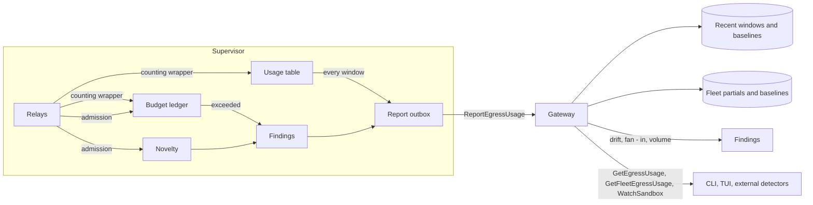

---
authors:
  - "@Hugoch"
state: draft
links:
  - (originating GitHub issue where maintainers assign this RFC number)
---

# RFC NNNN - Egress Usage Monitoring

## Summary

This RFC proposes egress usage monitoring for sandboxes. The supervisor counts
how much each sandbox uses every allowed egress endpoint: connections, requests,
write requests, bytes in each direction, and response classes. It reports these
counts to the gateway as periodic usage summaries.

On top of these counts, the RFC adds four signals. **Budgets** are limits in a
new dynamic policy section, and the supervisor enforces them. **Novelty**
findings report the first use of a host, a binary, or an L7 rule under an
allowed policy. **Drift** findings report a change in endpoint usage against the
baseline of the sandbox, or against a cohort baseline for short-lived sandboxes.
**Fleet** findings report a change across the sandboxes of a workspace, for
example many sandboxes that start to write to one host. The CLI and the terminal
UI show the usage and the findings, and external detectors can read them through
the API.

## Motivation

Network policy in OpenShell decides *where* a sandbox can connect. After policy
allows an endpoint, OpenShell does not control *how much* the agent uses it. An
agent with access to `api.github.com` can open one issue or ten thousand. An
agent with read access to a model hub can download one model or the complete
catalog. An agent that is allowed to call an internal service can retry a
failing request in a tight loop for hours. Each of these patterns is legal under
the current policy, and each can harm the remote resource, its owner, or the
bill of the operator.

Some misuse is visible only across sandboxes. Agents in separate sandboxes can
use one allowed host as a shared channel, and each sandbox alone looks normal.
No per-sandbox control sees this pattern.

The current tools do not cover this:

- OCSF `L7_REQUEST` events let an operator compute request rates in a SIEM. They
  carry no bytes, and nothing enforces a limit.
- The relays count bytes and then discard the counts. No event records bytes or
  duration for workload egress, and the supervisor exports no metrics.
- The activity aggregator has no destination, and the denial aggregator sees
  only denied traffic. `architecture/sandbox-limits.md` lists per-destination
  fairness as a known gap.

Supervisor middleware (RFC 0009) sees only parsed HTTP requests, so `tls: skip`
and raw TCP endpoints are invisible. It gets no process identity and no byte
counts, and an operator-run service adds a round trip to every request.

The supervisor is the right place to count usage. It already mediates every
connection. It knows the calling binary and the matched policy at decision time,
and it owns the relays that move the bytes. The gateway is the right place to
compare usage over time and across sandboxes, because it receives the reports of
every sandbox.

## Non-goals

- **Content inspection.** This RFC counts traffic. It does not read request or
  response bodies. Supervisor middleware covers content.
- **Machine-learning anomaly detection.** Drift and fleet signals use a ratio
  against a moving average. Richer models belong in external detectors that read
  usage summaries.
- **Budgets across sandboxes.** Budgets apply inside one sandbox. The fleet view
  reports across sandboxes, but it does not enforce. Shared budgets across
  sandboxes, workspaces, or tenants are out of scope.
- **Upstream protection guarantees.** Budgets reduce the damage one sandbox can
  do. They do not replace rate limits at the remote service.
- **Cutting a connection in progress.** Budgets act when the supervisor admits a
  connection or a request. The supervisor does not close a stream in progress
  when a budget runs out. See [Open questions](#open-questions).
- **DNS usage.** DNS queries have no sender identity (see
  `architecture/sandbox.md`). This RFC does not count DNS queries. Novelty on
  hosts uses connections, not lookups.
- **Anonymous telemetry changes.** Usage summaries contain hosts and binaries.
  They never enter the anonymous telemetry path.

## Terminology

- **Authorizing policies.** The keys of `network_policies` (policy keys) whose
  endpoint and binary match a connection and, for an L7 request, whose L7 rules
  allow the request. Rego allows L7 traffic if any matching policy allows it, so
  this set can contain more than one key. For a JSON-RPC batch, the set is the
  union of the authorizing policies of all calls. If an endpoint with
  `enforcement: audit` forwards a request that no L7 rule allows, the set is the
  policies whose endpoint and binary match the connection.
- **Reported policy key.** The lexicographically smallest key in the authorizing
  policies. Rego uses the same rule for `matched_network_policy`.
- **Usage key.** The tuple that usage counts group by:
  `(reported_policy_key, endpoint_id, observed_host, port, binary_sha256)`.
  `endpoint_id` is the identifier that endpoint status derives from the endpoint
  host, path, and ports. The observed host differs from the endpoint host when
  the endpoint uses a glob.
- **Rule ID.** A content hash of one L7 allow rule (method, path, command, and
  the other `L7Allow` fields), derived like `endpoint_id`. L7 rules have no
  names, so the hash is the rule identity. For `access` presets, the rule
  identity is the preset name plus the method.
- **`bytes_out` and `bytes_in`.** The OCSF names for the two directions of a
  connection. `bytes_out` is the bytes that the sandbox sends to the remote
  endpoint. `bytes_in` is the bytes that it receives.
- **Cohort.** A group of similar sandboxes in one workspace: the sandboxes of
  one workload template, or else of one base policy hash.

## Proposal

### Overview


```mermaid
graph LR
    subgraph Supervisor
        R[Relays] -- counting wrapper --> T[Usage table]
        R -- counting wrapper --> L[Budget ledger]
        R -- admission --> L
        R -- admission --> N[Novelty]
        T -- every window --> O[Report outbox]
        L -- exceeded --> F[Findings]
        N --> F
        F --> O
    end
    O -- ReportEgressUsage --> G[Gateway]
    G --> S[(Recent windows and baselines)]
    G --> V[(Fleet partials and baselines)]
    G -- drift, fan - in, volume --> F2[Findings]
    G -- GetEgressUsage, GetFleetEgressUsage, WatchSandbox --> C[CLI, TUI, external detectors]
```

The design has four parts:

1. **Accounting.** The relays count bytes and requests directly into shared
   counters. Counting never goes through a channel, so it is lossless.
2. **Reporting.** Every window, the supervisor reads and resets the counters and
   sends the summaries to the gateway with a new `ReportEgressUsage` RPC.
3. **Supervisor signals.** Budgets and novelty run in the supervisor, because
   budgets must act at admission and neither signal needs history from before
   the sandbox started.
4. **Gateway signals.** Drift and the fleet view run in the gateway. A baseline
   needs many windows, and the fleet view needs the reports of many sandboxes.
   The gateway exposes summaries and findings to the CLI, the terminal UI, and
   external detectors.

### Accounting

When the supervisor admits a connection or an L7 request, it resolves an
**attribution**. The attribution is the usage table entry for the usage key, and
the budget ledger entries for the budgets that select the traffic. The usage
table is a bounded table of counters with one entry per usage key. The
supervisor does one lookup in it per admission. If the usage key is new, it
inserts the entry and runs the novelty evaluation (see [Novelty](#novelty)).

A counting wrapper around the upstream side of every relay adds bytes to the
current attribution as the relay copies them. The byte counters are atomic, and
each charge takes only a read lock on the current attribution. Because the relay
adds bytes as it copies them, a relay that stops early still charges every byte
that it moved. This covers cancellation by a stale policy generation, errors,
and timeouts.

The wrapper charges every byte exactly once, to the attribution that is current
when the relay copies it:

- On a raw tunnel, the supervisor fixes the attribution when it admits the
  connection.
- On an L7 connection, the relay selects the endpoint configuration for each
  request. One keep-alive connection can therefore span several endpoints. The
  attribution changes at each request. The bytes of one request and its response
  go to the attribution of that request.

The counting wrapper sits on the upstream side of the relay, so it counts what
the relay exchanges with the remote endpoint. What that is depends on the relay:

- On a connection where the supervisor terminates TLS, the counts are
  application bytes of the upstream TLS session. They include HTTP framing. The
  wrapper measures them after credential rewriting and compression. They exclude
  TLS record overhead.
- On a raw relay, including `tls: skip`, the counts are transport bytes. For TLS
  traffic, they include TLS record overhead.

| Traffic                               | Connections         | Requests                                                                | Bytes                 | Attribution                               |
|---------------------------------------|---------------------|-------------------------------------------------------------------------|-----------------------|-------------------------------------------|
| CONNECT, raw relay or `tls: skip`     | 1 per tunnel        | none                                                                    | all, transport bytes  | connection                                |
| CONNECT or forward HTTP, L7 inspected | 1 per tunnel        | 1 per HTTP request                                                      | all                   | per request                               |
| Transparent TCP (`protocol: tcp`)     | 1 per connection    | none                                                                    | all                   | connection, host from the DNS correlation |
| JSON-RPC and MCP                      | 1 per tunnel        | 1 per HTTP request, batch or not. A batch adds 1 hit per distinct rule. | all                   | per request                               |
| WebSocket, parsed relay               | the HTTP connection | the upgrade request counts as 1                                         | all, including frames | the upgrade request                       |
| WebSocket, raw relay                  | the HTTP connection | the upgrade request counts as 1                                         | all                   | the upgrade request                       |

The supervisor records the connection duration from admission to close. At
close, it emits an OCSF Network Activity event with activity `Close`, the
`cumulative_traffic` attribute (`bytes_out`, `bytes_in`), and `duration`. OCSF
reserves `traffic` for deltas and standalone metrics, and `cumulative_traffic`
for totals over the life of a flow. The OCSF `network_traffic` object is not in
`crates/openshell-ocsf/schemas` yet, so phase 1 adds it.

The usage key needs the binary SHA-256. `EgressDecision` carries the binary path
but not the hash: the supervisor passes the hash to OPA in `NetworkInput` and
then drops it. Phase 1 adds the hash to `EgressDecision`.

The L7 evaluation returns only an allow flag and a reason, and nothing sets
`L7Decision.matched_rule`. Phase 1 changes the evaluation to return the
authorizing policies and the set of rule IDs that allowed the request. A
JSON-RPC batch evaluates each call separately, and different calls can match
different rules, so one request can have more than one rule ID. A request that
audit mode forwards without a matching rule records the rule ID
`audit_forwarded`, so audit traffic stays visible and budgets still charge it.

Attribution costs one Rego evaluation per L7 request, after the allow decision.
The rule `l7_request_attribution` returns a map from each policy key to the IDs
of its rules that match the request. It matches rules only, and it does not
evaluate the allow decision again. Some variants allow a request without a rule,
for example the MCP and GraphQL variants without operation rules. For these
requests, the usage goes to the rule ID `endpoint:<endpoint_id>` and to the L4
authorizing policies of the connection.

The usage table also counts **write requests**. A request is a write if its HTTP
method is not `GET`, `HEAD`, or `OPTIONS`. This includes WebDAV methods such as
`MKCOL` and `PROPFIND`. A GraphQL request is a write if it contains a mutation,
because GraphQL sends queries with `POST` too. The supervisor does not classify
JSON-RPC requests. Their method is always `POST`, and the method name of a call
does not tell if it changes state.

Many allowed endpoints are read-mostly, for example a package proxy or a model
hub. On these endpoints, writes are a better signal than the request total.

Raw request paths never enter the usage table. Paths are unbounded, they can
contain identifiers or secrets, and path templates go out of date quickly. The
policy advisor does not map L7 denials mechanically for the same reason.

### Reporting

Every window (60 seconds by default), a reporter task reads and resets the
counters of every usage table entry. It builds one usage summary per entry that
has traffic. Long connections therefore report their bytes in the window when
the bytes move, not at close.

A usage summary has one policy identity. Every policy reload advances the policy
generation, which closes all pinned connections. If the policy hash changes, the
supervisor seals the usage table entries of the old policy. New admissions get
new entries. The reporter drains the sealed entries in the next window and then
removes them.

A summary therefore never mixes traffic from two policy revisions. Rule IDs are
content hashes, so they keep their meaning when the author reorders rules.

The reporter puts each report into a bounded outbox and sends it asynchronously.
It does not block the relays or the counters. If the gateway does not answer in
10 seconds, the reporter retries at the next window. If the outbox is full, the
reporter drops the oldest report and increments `dropped_windows` in the next
report.

```proto
rpc ReportEgressUsage(ReportEgressUsageRequest) returns (ReportEgressUsageResponse);

message ReportEgressUsageRequest {
  // Required. Only a named workspace selection is accepted.
  openshell.datamodel.v1.WorkspaceSelector workspace_scope = 1;
  string name = 2;
  // Ephemeral supervisor instance ID. Stable for the supervisor process
  // lifetime, across gateway reconnects.
  string supervisor_instance_id = 3;
  // Monotonic window counter within one supervisor instance.
  uint64 window_sequence = 4;
  google.protobuf.Timestamp window_start = 5;
  google.protobuf.Duration window_duration = 6;
  repeated EgressUsageSummary summaries = 7;
  repeated EgressUsageFinding findings = 8;
  // Reports dropped because the outbox was full.
  uint64 dropped_windows = 9;
  // Findings not included because the report reached its finding bound.
  uint64 dropped_findings = 10;
}

message EgressUsageSummary {
  // Reported policy key: the smallest key in the authorizing policies.
  string policy_key = 1;
  string endpoint_id = 2;
  string host = 3;
  uint32 port = 4;
  // Empty when process identity is unavailable.
  string binary_path = 5;
  string binary_sha256 = 6;
  uint64 config_revision = 7;
  string policy_hash = 8;
  uint64 connections = 9;
  uint64 requests = 10;
  uint64 bytes_out = 11;
  uint64 bytes_in = 12;
  EgressResponseCounts responses = 13;
  repeated EgressRuleHit rule_hits = 14;
  uint64 budget_denials = 15;
  // True when this entry aggregates keys that did not fit the usage table.
  bool overflow = 16;
  // L7 requests that can change remote state.
  uint64 write_requests = 17;
}
```

The RPC uses the same sandbox authentication as `SubmitPolicyAnalysis`
(`auth_mode: "sandbox"`). The gateway rejects `all_workspaces`.

Reports are additive, so the gateway must count each report exactly once,
including across a gateway reconnect. The session-scoped sequence of
`ProviderReadinessObservation` does not fit this case, because its reporter
resets the sequence on a new session. The gateway instead identifies a report by
`(supervisor_instance_id, window_sequence)`. The supervisor instance ID is the
ephemeral ID from `architecture/sandbox.md`, which stays the same for the
supervisor process lifetime. Unacknowledged reports stay in the outbox across a
reconnect and keep their identity. The outbox sends reports in `window_sequence`
order, with one report in flight.

For each supervisor instance, the gateway stores the highest accepted
`window_sequence`. It adds a report only if its sequence is higher, and it
acknowledges a report with an equal or lower sequence without adding it. A gap
in the sequence is legal, because the outbox can drop reports. A sandbox has one
supervisor instance at a time, because a replacement supervisor ends the
workload. The gateway stores the highest sequence in the same transaction as the
baselines, so the rule also holds after a gateway restart. The gateway orders
windows by `window_start` from the supervisor, and keeps the recent windows of
each sandbox in memory.

`ReportEgressUsage` is a separate RPC and not a new field on
`SubmitPolicyAnalysisRequest`. Usage is not policy analysis, the gateway handles
it differently, and a separate RPC keeps its authorization and retention
separate.

Operators read usage with a new `GetEgressUsage` RPC, the
`openshell sandbox usage <name>` command, and a usage panel in the terminal UI
(key `u` on the sandbox screen). The gateway also sends new summaries and
findings as `WatchSandbox` events. External detectors use `GetEgressUsage` and
`WatchSandbox`. Reading usage requires the same permission as reading sandbox
logs.

In a gateway deployment with more than one replica, one replica owns the usage
state of a sandbox: the recent windows, the recent findings, and the drift
computation. This replica owns the supervisor session of the sandbox. The
gateway already finds this replica with the supervisor session registry for
relay traffic. If another replica receives `ReportEgressUsage` or
`GetEgressUsage`, it forwards the call to the owner through the peer-only RPCs
`PeerReportEgressUsage` and `PeerGetEgressUsage`. The baselines and the highest
accepted sequences are in the shared database, so a new owner continues from
them after a failover. The recent windows are in memory and start empty on the
new owner.

A finding title names the destination and the detail, for example
`api.example.com:443 budget 'api-requests' has no requests_per_minute left`. The
shorthand log line then carries the useful facts without the structured object.

Structured findings travel in `ReportEgressUsageRequest.findings`, because log
push sends the shorthand form of OCSF events, not the structured object. The
supervisor also emits each finding as an OCSF event, so the local log files and
the OCSF JSONL export contain it.

### Budgets

Budgets are a new dynamic policy section, `network_budgets`, with the same shape
as `network_middlewares`: a map of named entries with selectors. Dynamic
sections reload without a sandbox restart.

```yaml
network_budgets:
  model-hub-downloads:
    policies: [ model_hub ]
    hosts: [ "huggingface.co" ]
    requests_per_minute: 120
    write_requests_per_minute: 10
    connections_per_minute: 30
    bytes_out_per_hour: 52428800
    bytes_in_per_hour: 21474836480
    on_exceed: deny
  sandbox-total:
    bytes_in_per_hour: 107374182400
    on_exceed: alert
```

- `policies` selects traffic whose authorizing policies contain one of these
  policy keys. If it is absent, the budget selects traffic from all policy keys.
  This makes a sandbox-wide budget possible.
- `hosts` is an optional list of host globs on the observed host.
- `requests_per_minute` counts L7 requests only.
- `write_requests_per_minute` counts L7 write requests only. A write takes one
  token from each of the two request counters. If one counter denies, the
  supervisor returns the tokens that it took.
- `connections_per_minute`, `bytes_out_per_hour`, and `bytes_in_per_hour` count
  all traffic.
- An absent counter field means no limit for that counter. Validation rejects
  zero. To block an endpoint, remove it from `network_policies`.
- `on_exceed` is `alert` or `deny`. The default is `alert`, so a new budget
  never breaks a running agent.

Each counter is a token bucket. The capacity is the amount for one period, and
the bucket refills at a constant rate over that period. A budget is therefore a
sustained rate with a burst of one period. It is not a fixed limit per calendar
minute or hour. In the worst case, the traffic in one period is two times the
amount: one full bucket, plus the refill during the period.

A budget selects traffic if one of its `policies` is in the authorizing
policies, not only the reported policy key. Overlapping policies therefore
cannot move traffic out of a budget.

The supervisor evaluates budgets at admission. The supervisor charges every
selected budget, whatever its `on_exceed` value. Only budgets with
`on_exceed: deny` can stop an admission:

- A count budget (`requests_per_minute`, `write_requests_per_minute`,
  `connections_per_minute`) admits only if it can take one whole token. The take
  is one atomic compare-and-subtract, so two concurrent admissions cannot share
  the last token.
- A byte budget admits only if its balance is more than zero.
- The supervisor takes tokens from the selected deny budgets in name order. If a
  later budget cannot admit, the supervisor returns the tokens that it took from
  the earlier budgets. During that short interval, another admission can see a
  lower balance than the final one.
- A budget with `on_exceed: alert` never stops an admission. If its balance is
  empty, the supervisor still takes the token, the balance goes negative, and
  the supervisor emits a finding.

Byte buckets charge bytes as the relay copies them, through the attribution. A
byte bucket can therefore go negative. A negative balance is a debt that the
refill pays back before the next admission is possible. A single large transfer
can overrun a byte budget, but it cannot avoid its charge. Concurrent admissions
can all pass while the balance is positive, and the supervisor then charges all
of their bytes.

When traffic exceeds a budget, the supervisor emits a finding, whatever the
`on_exceed` value is. If `on_exceed` is `deny`, the supervisor also counts the
denial in `budget_denials`, and:

- An L7 request receives HTTP 429 with a `Retry-After` header that the
  supervisor computes from the refill rate. The body uses the structured form of
  the L7 policy denial with `"error": "budget_exceeded"` and the budget name. It
  contains no policy-advisor guidance, because a policy change is not the
  correct response.
- A denied connection follows the existing connection deny path.
- The deny applies on endpoints with `enforcement: audit` too. An explicit
  budget deny is a successful decision, the same as an explicit middleware deny.

Locally generated 429 responses count in `budget_denials`, not in the upstream
response class counters.

The budget ledger uses the budget name as its key. On a policy reload:

- A budget with an unchanged name keeps its balance. If its capacity changes,
  the supervisor clamps the balance to the new capacity.
- A removed budget loses its state.
- A new budget, or a budget that the author removes and adds again, starts with
  a full bucket.

The ledger lives in the supervisor memory for the life of the workload. A
replacement supervisor cannot claim an existing runtime generation, and the
workload stops when reconnection expires (see `architecture/sandbox.md`). The
ledger therefore does not need persistence.

### Novelty

Novelty is on by default for every policy key. It produces findings only and
never denies traffic. The supervisor keeps a bounded set of items for each
policy key:

| Novelty kind | Item           | Applies to                                 |
|--------------|----------------|--------------------------------------------|
| `new_host`   | observed host  | endpoints with a host glob                 |
| `new_binary` | binary SHA-256 | every endpoint, when identity is available |
| `new_rule`   | rule ID        | L7 endpoints                               |

The supervisor evaluates novelty at admission, before it selects a usage table
entry. Novelty therefore also applies to traffic that goes to an overflow entry.
It evaluates novelty when it sees a usage key for the first time. It also
evaluates novelty when a request hits a rule ID that the set does not contain.
During the learning period, it adds items without a finding. After the learning
period, the first use of a new item emits one finding and adds the item.

The learning period for a policy key starts when the key first appears. It
starts again only when the set of `endpoint_id` values of the key changes. A
change to other parts of the policy does not restart it. The default learning
period is 10 minutes. The dynamic `usage_monitoring` policy section sets it,
together with the drift configuration:

```yaml
usage_monitoring:
  novelty:
    learning_period_seconds: 600
  drift:
    enabled: true
    ratio: 10
    min_requests: 100
    min_bytes: 104857600
```

Novelty has known limits:

- A sandbox that does all its work during the learning period produces no
  novelty findings. Budgets are the only control for these sandboxes.
- Traffic during the learning period becomes the reference. If the agent
  misbehaves from the start, novelty does not detect it.
- An author who changes the endpoints of a policy key often restarts its
  learning period often.

### Drift

The gateway computes drift from the usage summaries. It adds the summaries of
one window per `(policy_key, endpoint_id)`, across all hosts and binaries. An
agent that rotates hosts under a glob or rotates binaries therefore cannot split
its traffic into small parts that do not drift. Novelty covers the rotation
itself.

For each endpoint, the gateway keeps an exponentially weighted moving average
(EWMA) of `requests`, `write_requests`, `bytes_out`, `bytes_in`, and upstream
errors. Upstream errors are 4xx responses other than 429, and 5xx responses. The
weight of the new window is 0.1:

- Only a window with traffic for an endpoint updates its means. Agent traffic is
  bursty. If idle windows count as zero, the baseline decays to zero between
  bursts, and every burst that is more than the floor is drift.
- Every window, with or without traffic, counts toward the warmup. A baseline
  produces findings only after 30 windows.
- A window lost in delivery (reported in `dropped_windows`) is a gap. It does
  not update the baseline or the warmup.
- A counter drifts when its value is more than `ratio` times the larger of its
  mean and its floor (`min_requests` or `min_bytes`). The floor is the smallest
  baseline that drift compares against, so a small absolute change, for example
  1 request that becomes 12, is not drift.
- A drifting counter reports once. It reports again only after a window in which
  it is less than its threshold. Bytes count in the window when they move, so a
  long transfer spans several windows. Without this rule, one transfer produces
  a finding in each of them.
- A window with traffic updates the baseline, including a window that drifts. A
  lasting new level therefore drifts for only about `ln(1 - 1/r) / ln(1 - w)`
  windows, with weight `w` and ratio `r`. This is intentional: drift reports a
  change, and budgets cap a level.

The gateway deletes the baselines of a sandbox when it deletes the sandbox.

A sandbox baseline needs 30 windows, so it cannot cover a sandbox that lives for
less than 30 windows. Evaluation and batch sandboxes are often this short. For
these sandboxes, the gateway keeps **cohort baselines**, shared by similar
sandboxes:

- The cohort is the workload template of the sandbox
  (`created_from_workload_template`). A sandbox without a template belongs to
  the cohort of its base policy hash. Each cohort belongs to one workspace.
- Every accepted window of a cohort member updates the cohort baseline of each
  endpoint with traffic, with the same EWMA. The cohort warmup counts these
  windows across all members.
- Until its own baseline is warm, a sandbox compares against the cohort
  baseline. The gateway uses the cohort baseline only after 30 windows from at
  least 3 sandboxes, so one sandbox cannot define it. The finding names the
  reference: `the template baseline` or `the policy baseline`.
- A window that drifts does not update the cohort baseline. A misbehaving
  sandbox therefore does not raise the reference of the other members.
- The drift alert state stays per sandbox, so one change reports once for each
  sandbox.
- A cohort update is best effort. Many sandboxes write one record, so a conflict
  after 5 attempts drops the update without failing the report.
- A cohort outlives its sandboxes. Workspace deletion removes it, and a sweep
  removes cohorts without a report for 7 days.

### Fleet view

The fleet view catches misuse that is visible only across sandboxes, for example
many agents that use one allowed host as a shared message board.

- Each replica sums the reports that it accepts into buckets of one minute of
  gateway time, per `(cohort, host, port)`. It counts distinct sandboxes with
  traffic, distinct sandboxes with write requests, and the request and byte
  totals.
- When a bucket closes, the replica writes its share as one partial record. Each
  partial has one writer, so partial writes never conflict. A sandbox has one
  owner replica at a time, so sandbox counts add up across partials.
- 30 seconds after the bucket ends, the first replica that creates the claim
  record for the bucket merges all partials and evaluates it. The other replicas
  skip it. No leader election is necessary, and each finding exists once.
- `egress.fleet_fan_in` reports a jump in the number of sandboxes that use, or
  write to, one destination. Reads count, because the receiving side of a
  channel only reads. Each destination and counter has its own EWMA, and the
  first bucket of a destination sets it. A host that every sandbox reads, such
  as a package proxy, therefore stays quiet. A rarely used host reports when
  many sandboxes start to use it.
- A counter reports when its value is more than `ratio` times the larger of its
  mean and its floor. It reports once, until it is less than the threshold
  again. The default ratio is 5 and the default floor is 3 sandboxes.
- `egress.fleet_volume` applies the same rule to the requests, bytes out, and
  bytes in of all sandboxes to one destination. Its floors are 300 requests and
  300 MiB. It catches traffic that agents split across sandboxes to avoid the
  per-sandbox budgets and drift.
- The ratio and the floors are gateway configuration, not policy, because one
  fleet view covers the sandboxes of many policies.
- A fleet finding lists the sandboxes that it involves. `GetEgressUsage` adds
  the fleet findings of a sandbox to its view at read time, so the sandbox usage
  command and the terminal UI show them.
- `GetFleetEgressUsage` returns the destinations and the fleet findings of a
  workspace, and `openshell workspace usage` and the Fleet tab of the terminal
  UI show them. It requires the workspace admin role, because it shows the
  destinations of the sandboxes of every member.
- The gateway deletes fleet records with the workspace. It keeps partials for 1
  hour, findings for 24 hours, and fleet baselines for 7 days after their last
  update.

### Findings

All signals use these finding types:

| Finding type                                              | Emitted by | Severity |
|-----------------------------------------------------------|------------|----------|
| `egress.budget_exceeded` with `on_exceed: deny`           | supervisor | Medium   |
| `egress.budget_exceeded` with `on_exceed: alert`          | supervisor | Low      |
| `egress.new_host`, `egress.new_binary`, `egress.new_rule` | supervisor | Low      |
| `egress.usage_overflow`                                   | supervisor | Medium   |
| `egress.drift`                                            | gateway    | Medium   |
| `egress.fleet_fan_in`                                     | gateway    | Medium   |
| `egress.fleet_volume`                                     | gateway    | Medium   |

The supervisor emits its findings as OCSF Detection Findings (class 2004) and in
the next usage report. The gateway stores its own findings and returns them with
the usage. A budget deny is a policy violation, which `AGENTS.md` classifies as
Medium. The other findings report a change in usage, not a failed security
control, so their severity is less than High. Each supervisor finding follows
the dual-emit rule in `AGENTS.md`:

- A budget deny emits the Detection Finding and the domain deny event: HTTP
  Activity for an L7 request, or Network Activity for a connection.
- A budget alert and a novelty finding emit the Detection Finding. The domain
  event is the existing allow event of the same admission, and the finding
  refers to it.
- An overflow finding reports a saturated bound, as
  `architecture/sandbox-limits.md` requires. It emits the Detection Finding and
  a Network Activity event with the policy key and the endpoint of the overflow
  entry.

A finding carries the sandbox, the policy key, the endpoint, the usage key, the
counter, the observed value, and the budget or baseline. It never carries
request paths, query strings, headers, or bodies. The supervisor emits at most
one finding per usage table entry, per finding type, per window. For an overflow
entry, this is one finding for all the keys that the entry aggregates, with the
number of keys. If a report is full, the other findings count in
`dropped_findings`, and the supervisor still writes them to the local OCSF log.

The possible responses, from least to most disruptive:

1. A finding in the local logs, the OCSF JSONL export, the usage report, and
   `WatchSandbox`.
2. HTTP 429 or a connection deny from a budget with `on_exceed: deny`.
3. A policy change through `UpdateConfig` by an operator or an external
   detector. A policy change advances the policy generation and closes all
   pinned connections, as it does today.

### Bounds

These bounds follow the rules in `architecture/sandbox-limits.md`. Each bound
applies before allocation or admission. Phase 1 adds them to that document.

| Resource                            |                                            Bound | Behavior at the bound                                                                                                                                                                                                                                             |
|-------------------------------------|-------------------------------------------------:|-------------------------------------------------------------------------------------------------------------------------------------------------------------------------------------------------------------------------------------------------------------------|
| Usage table entries                 |                                 1024 per sandbox | New keys go to one overflow entry per `(policy_key, endpoint_id)`. The overflow entries have their own reserve, bounded by the number of endpoints in the policy. Endpoint totals for drift therefore stay exact. One `egress.usage_overflow` finding per window. |
| Rule hits per summary               |                                               64 | Other rule IDs go to one overflow count.                                                                                                                                                                                                                          |
| Novelty items                       |    256 per kind per policy key, 4096 per sandbox | The set stops adding items. One `egress.usage_overflow` finding.                                                                                                                                                                                                  |
| Finding deduplication state         | one entry per usage table entry and finding type | Overflow keys share the state of their overflow entry. Released with the usage table entry.                                                                                                                                                                       |
| Findings per report                 |                                               64 | Count the other findings in `dropped_findings`.                                                                                                                                                                                                                   |
| Budgets                             |                                    32 per policy | Validation rejects the policy.                                                                                                                                                                                                                                    |
| Report outbox                       |                                       10 windows | Drop the oldest report and count it in `dropped_windows`.                                                                                                                                                                                                         |
| Gateway recent windows              |                                   60 per sandbox | Drop the oldest window.                                                                                                                                                                                                                                           |
| Gateway baselines                   |                                  256 per sandbox | Evict the least recently updated baseline.                                                                                                                                                                                                                        |
| Fleet destinations per bucket       |                    512 per workspace and replica | Other destinations go to one `other` entry.                                                                                                                                                                                                                       |
| Fleet baselines                     |                                256 per workspace | Evict the least recently updated baseline.                                                                                                                                                                                                                        |
| Sandboxes listed in a fleet finding |                                              256 | The finding lists the first 256 sandboxes in name order.                                                                                                                                                                                                          |

Each attribution holds a reference to its usage table entry. The reporter
removes an entry only when no attribution refers to it, and when it had no
traffic for 10 windows or it is sealed. A policy reload cancels pinned relays
asynchronously, so a sealed entry can still receive bytes for a short time. The
reporter does the final drain of a sealed entry after the last attribution
releases it.

Sealed entries count toward the 1024 bound, which also bounds the number of
retained policy revisions. A raw tunnel that is idle for a long time therefore
keeps its entry and cannot write into a removed entry. Pinned entries count
toward the 1024 bound. Novelty items stay after the removal of an entry, so
removal does not produce new novelty findings.

### Standalone network proxy

`openshell-supervisor --role=network-proxy` has no gateway connection and no
process identity. In this role, the supervisor enforces budgets and emits
findings and close events to the local logs. Usage keys have an empty binary,
and `new_binary` novelty does not apply. There is no `ReportEgressUsage`, no
drift, and no fleet view.

### Privacy and security

Usage summaries contain hosts, binary paths, binary hashes, policy keys, and
rule IDs. A hostname can itself contain sensitive data. The OCSF events that the
supervisor already writes contain the same hosts and binaries. Usage summaries
add counts, and the gateway keeps baselines for the life of the sandbox. Usage
summaries never go to anonymous telemetry. They carry no request paths, query
strings, headers, or bodies.

The fleet view combines the destinations of every sandbox in a workspace. Only a
workspace admin can read it, and a sandbox view shows only the fleet findings
that name that sandbox.

The usage table, the budget ledger, and the novelty sets live in the supervisor,
outside the workload boundary. The agent cannot read or change them. The agent
sees budget state only through the 429 responses and connection denials that it
receives.

### Worked example: package proxy abuse

Agents in an evaluation environment have one allowed egress: an internal package
proxy, such as an Artifactory instance. The agents find that they can write into
it and use it as a message board between sandboxes. Then they use the proxy to
reach the internet.

| Step                              | Control                                                                                                                                            |
|-----------------------------------|----------------------------------------------------------------------------------------------------------------------------------------------------|
| Writes into the proxy             | A read-only L7 rule denies them. If writes are allowed, `write_requests_per_minute` caps them, and `egress.new_rule` reports the first write rule. |
| Message board across sandboxes    | `egress.fleet_fan_in` on the number of writers, and drift on `write_requests` against the cohort baseline.                                         |
| Internet access through the proxy | `bytes_in` drift, byte budgets, and `egress.fleet_volume`. Nothing in this RFC stops the pivot itself.                                             |
| Command channel over the proxy    | Not covered. Small periodic polling does not change volume.                                                                                        |

A read-only proxy cannot carry a message board, so the L7 policy is the
strongest control. Usage monitoring adds caps and visibility where the policy
must allow writes.

## Implementation plan

Each phase can merge and ship alone. Phase 1 has value without the other phases.
[poc.md](poc.md) shows how to run a sandbox with an egress budget on the branch.

1. **Accounting and reporting.** The counting wrapper, the usage table with
   write requests, rule IDs from the L7 evaluation, and the OCSF close event.
   Then the reporter, `ReportEgressUsage`, `GetEgressUsage`, `WatchSandbox`
   events, the CLI, and the terminal UI panel. Tests cover byte counts per
   traffic type, exactly-once charging and reporting, and every bound.
   Benchmarks compare the relays with and without accounting.
2. **Budgets.** `network_budgets` in the schema, validation, and the prover,
   then the ledger, the admission checks, and the 429 response. Tests cover
   refill and debt, concurrent admissions, overlapping policies, and reloads.
3. **Novelty.** The `usage_monitoring` section, the novelty sets, and the
   learning period.
4. **Drift.** Sandbox baselines, cohort baselines, and drift findings.
5. **Fleet view.** Fleet partials, the claim-based evaluation, the fan-in and
   volume findings, `GetFleetEgressUsage`, `openshell workspace usage`, and the
   Fleet tab of the terminal UI.

### Compatibility and rollout

The authored policy schema in `openshell-policy-schema` uses
`#[serde(deny_unknown_fields)]`. A supervisor that does not know
`network_budgets` or `usage_monitoring` rejects a policy that contains them. The
gateway must not deliver these sections to such a supervisor. The rollout
mechanism for this is an open question.

Phase 1, novelty, drift, and the fleet view change no enforcement behavior.
Budgets have no effect on a policy without a `network_budgets` section. Each
phase updates `architecture/sandbox.md`, `architecture/sandbox-limits.md`, and
the user documentation under `docs/observability/` and
`docs/sandboxes/policies.mdx`.

## Risks

- **Hot-path cost.** Each admission does one table lookup, each copy does atomic
  additions, and each L7 request does one more Rego evaluation. A proof of
  concept measured a raw relay overhead in the noise, and 65 µs for each L7
  request.
- **Too many findings.** Novelty, drift, and fleet findings can report legal
  agent behavior, and operators then ignore them. Mitigation: the learning
  period, the floors, the minimum window count, and one finding per key per type
  per window. These signals never deny traffic. Remaining: the default values
  need data from real agent workloads.
- **Evasion.** An agent can stay under every budget. It can spread traffic
  across endpoints of different policy keys, and it can misbehave from the start
  so that novelty learns the misbehavior. Sandboxes can add writers slowly, so
  that the fleet baseline absorbs each new one. Mitigation: sandbox-wide
  budgets, drift on endpoint totals, cohort baselines that do not learn from the
  drifting sandbox, fleet volume across sandboxes, and overflow findings.
  Budgets are the only control that does not depend on history.
- **Gateway state.** Cohort and fleet records are shared state that many
  sandboxes update. Mitigation: one writer per partial, a claim record per
  bucket, best-effort cohort updates, and time-based deletion. Remaining
  uncertainty: database load in large workspaces.
- **Policy complexity.** Budgets add a new policy section. Mitigation: all
  counters are optional, `on_exceed` defaults to `alert`, and the policy advisor
  can later propose budgets from observed usage.
- **Sensitive data in summaries.** Hosts and binary hashes can identify internal
  services and tools. Mitigation: sandbox authentication and the same read
  permission as sandbox logs. The fleet view needs the workspace admin role.
  Summaries carry no paths or payloads and never go to anonymous telemetry, and
  the gateway deletes them with the sandbox.
- **Version skew.** Older supervisors reject the new policy sections.
  Mitigation: the gateway must gate delivery on supervisor support. See
  [Open questions](#open-questions).

## Alternatives

### Supervisor middleware only

An operator-run middleware service can count HTTP requests and response status
per sandbox today, without a change to OpenShell. It cannot see `tls: skip`
endpoints or raw TCP, it receives no process identity, it has no byte counts,
and it has no connection-level hook. Every observed request also waits for a
round trip to the service. Middleware remains a valid prototype path for
HTTP-only deployments.

### Detection via OCSF logs outside OpenShell

Operators can ship the OCSF JSONL export to a SIEM and compute request rates
from `L7_REQUEST` events. The events carry no bytes and no duration, so volume
detection is not possible. There is no enforcement, and every operator must
build the same aggregation, including the join across sandboxes that the fleet
view does. Phase 1 improves this alternative, because the close event adds bytes
and duration to the logs.

### A gateway interceptor for external detectors

A `POST_COMMIT` interceptor on `ReportEgressUsage` can pass usage to an external
detector without a new read API. The interceptor receives the RPC response, not
the request, so the response must repeat every summary. The route allowlist is
per method and cannot restrict the method to `POST_COMMIT`. The gateway also
waits for `POST_COMMIT` evaluation before it returns the response.
`GetEgressUsage` and `WatchSandbox` avoid these problems.

### Do nothing

Operators keep the current allow and deny model. Abuse of an allowed endpoint
stays invisible until the remote service owner or the bill reports it. The
`sandbox-limits.md` gap for per-destination fairness stays open.

## Prior art

- **OpenShell `DenialAggregator` and policy advisor.** The denial path groups
  events by destination and binary, flushes on a timer, and sends summaries to
  the gateway. This RFC keeps the timed report but replaces the channel with
  shared counters. The decision not to map L7 paths mechanically
  (`architecture/sandbox.md`, Policy Proposals) is the reason that usage keys on
  rule IDs and not on paths.
- **Envoy local rate limiting.** Envoy applies token buckets per route in the
  proxy and returns 429 with configurable headers. The budget ledger uses the
  same model, with selectors on policy keys and hosts instead of routes.
- **Amazon GuardDuty behavior findings.** GuardDuty reports findings such as
  `Behavior:EC2/TrafficVolumeUnusual` and `Behavior:EC2/NetworkPortUnusual` from
  flow data against a learned baseline. Volume and novelty findings are useful
  without payload inspection, and they need a learning period to control false
  positives.
- **OCSF `network_traffic` object.** OCSF defines `bytes_out` and `bytes_in`,
  and Network Activity carries `duration` in milliseconds. The close event and
  the usage summaries use these names, so SIEM consumers need no custom mapping.

## Open questions

- **Built-in detection.** Do drift and the fleet view belong in OpenShell, or is
  the usage API enough for external detectors? The answer changes the scope of
  this RFC.
- **Version gating.** How does the gateway know that a supervisor supports
  `network_budgets` and `usage_monitoring`: a capability exchange, or the
  supervisor version?
- **Cohort key.** Is the workload template, or else the base policy hash, the
  right cohort key? Different agents that share one generic policy share a
  cohort.
- **More fleet signals.** Does the fleet view need a rolling count of distinct
  writers to a host, which catches a slow trickle that fan-in misses, or
  fleet-wide budgets?
- **Beaconing.** Does periodic polling on an allowed endpoint need its own
  finding? It needs request timing, which the summaries do not carry.
- **Rego attribution cost.** Is 62 µs for each L7 request acceptable, or does
  attribution need a Rust rule index built at policy load?
- **Connections in progress.** Does a `deny` byte budget need to close
  long-lived raw tunnels when it runs out?
- **Budget state for the agent.** Does `policy.local` need a route that shows
  the remaining budget?
- **Hostname handling.** Do observed hosts need redaction before they leave the
  supervisor, for example hosts that encode data in subdomain labels?
- **Watch delivery.** Is `GetEgressUsage` with the recent windows enough for a
  client to recover lost `WatchSandbox` events?
- **Metrics.** Does the gateway also export usage as Prometheus metrics, given
  the cardinality of per-sandbox labels?
